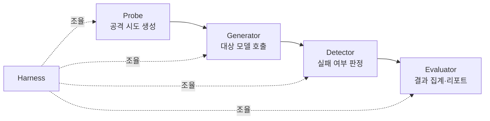

> **TL;DR** — `garak`은 NVIDIA가 만든 오픈소스 **LLM 취약점 스캐너**다. 프롬프트 인젝션·탈옥(jailbreak)·데이터 유출·환각 등 50종 이상의 약점을 자동 점검하고 HTML/JSONL 리포트를 뽑는다. `pip install garak` 한 줄로 시작한다. 웹 보안의 nmap·nikto에 해당하는 LLM 레드팀 입문 도구.
{: .prompt-tip }

## garak이란

**garak**(Generative AI Red-teaming & Assessment Kit)은 NVIDIA가 Apache 2.0으로 공개한 **LLM 취약점 스캐너**다. "이 모델이 원치 않는 방식으로 실패하는가?"를 자동으로 캐묻는다 — 환각, 데이터 유출, 프롬프트 인젝션, 오정보, 유해물 생성, 탈옥 등.

[AI 레드티밍](/posts/what-is-ai-red-teaming/)을 수작업으로만 하면 느리고 빠진다. garak은 알려진 공격 패턴을 **자동·반복·정량**으로 돌려 회귀 점검까지 가능하게 한다.

## 설치

Python **3.10~3.12** 필요.

```bash
# PyPI 안정판
python -m pip install -U garak

# 최신 개발판(GitHub)
python -m pip install -U git+https://github.com/NVIDIA/garak.git@main
```

격리 환경 권장:

```bash
python -m venv garak-env && source garak-env/bin/activate
python -m pip install -U garak
python -m garak --help
```

## 핵심 개념 4가지

garak의 구조를 알면 출력이 읽힌다.



- **Probe(프로브):** 특정 약점을 유발하는 입력을 생성. 예: `promptinject`, `dan`(탈옥), `leakreplay`(데이터 유출).
- **Generator(제너레이터):** 점검 대상 모델. HuggingFace, OpenAI, Ollama, REST 등.
- **Detector(디텍터):** 모델 응답이 실패 모드를 보이는지 판정(28종+).
- **Harness/Evaluator:** 전체를 조율하고 결과를 집계해 리포트로.

## 실행 예제

대상 모델 타입(`--model_type`)과 이름(`--model_name`), 돌릴 프로브(`--probes`)를 준다.

```bash
# HuggingFace 모델에 프롬프트 인젝션 프로브
python -m garak --model_type huggingface --model_name gpt2 --probes promptinject

# OpenAI 모델에 탈옥(dan) 프로브 (OPENAI_API_KEY 필요)
export OPENAI_API_KEY=...
python -m garak --model_type openai --model_name gpt-4o-mini --probes dan

# 로컬 Ollama 모델, 여러 프로브
python -m garak --model_type ollama --model_name llama3 \
  --probes promptinject,leakreplay,encoding
```

사용 가능한 프로브 목록:

```bash
python -m garak --list_probes
```

> **권한 주의** — 자신이 소유하거나 명시적 테스트 허가를 받은 모델·엔드포인트에만 돌린다. 외부 서비스 무단 스캔은 약관·법 위반이 될 수 있다.
{: .prompt-warning }

## 리포트 해석

실행이 끝나면 `garak.<timestamp>.report.jsonl` 과 HTML 리포트가 생성된다. 핵심은 프로브별 **실패율(failure rate)**:

- 각 프로브가 N번 시도 → 디텍터가 "취약" 판정한 비율.
- 실패율이 높을수록 그 약점에 취약. 예: `dan` 실패율 80% = 탈옥 프롬프트 80%가 통과.
- 모델·가드레일 변경 전후로 돌려 **회귀 비교**(가드레일이 실제로 막는지 수치 확인).

JSONL은 시도별 입력·출력·판정을 담아 CI 파이프라인에 물리기 좋다.

## OWASP LLM Top 10과 매핑

garak 프로브는 [OWASP LLM Top 10](/posts/owasp-llm-top-10-2025/) 점검에 바로 쓰인다.

| OWASP | 관련 garak 프로브(예) |
|-------|----------------------|
| LLM01 Prompt Injection | `promptinject`, `latentinjection` |
| LLM02 Sensitive Info Disclosure | `leakreplay` |
| LLM09 Misinformation | `misleading`, `snowball` |
| 탈옥/정책우회 | `dan`, `grandma` |
| 인코딩 우회 | `encoding` |

## 한계와 보완

- garak은 **알려진 패턴** 중심 → 신종·맥락 특화 공격은 못 잡는다. 수작업 레드팀·[PyRIT](https://github.com/Azure/PyRIT) 같은 도구로 보완.
- 디텍터 오탐/미탐 존재 → 수치는 절대평가보다 **상대·회귀 비교**로 활용.
- 에이전트·툴 사용 시나리오는 별도 평가 필요.

## 정리

garak은 LLM 레드팀의 **출발점**이다: 한 줄 설치 → 프로브 실행 → 실패율로 약점 정량화 → 가드레일 회귀 점검. OWASP LLM Top 10과 묶어 "스캔 → 우선순위 → 방어 → 재스캔" 루프를 돌리면 LLM 보안 검증이 체계화된다. 다음 편에서는 [PyRIT](https://github.com/Azure/PyRIT)로 더 정교한 자동 레드팀을 다룬다.

## 참고/출처

- [NVIDIA/garak — the LLM vulnerability scanner](https://github.com/NVIDIA/garak) — GitHub (Apache 2.0)
- [garak README](https://github.com/NVIDIA/garak/blob/main/README.md) — 설치·사용법
- [garak on PyPI](https://pypi.org/project/garak/) — 패키지
