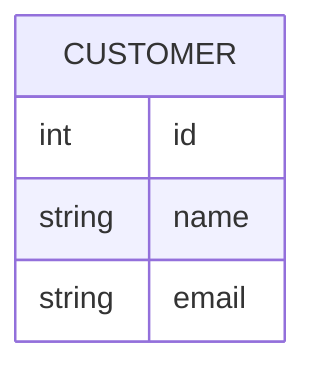
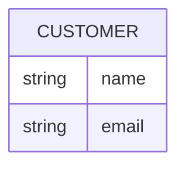
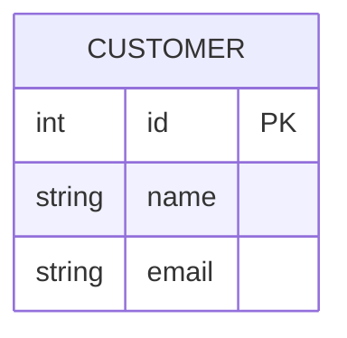
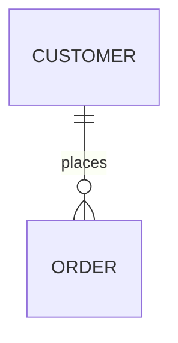
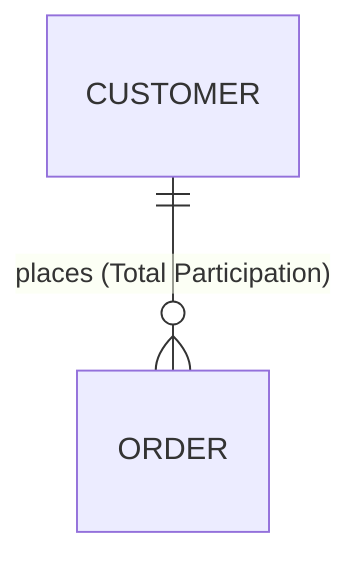
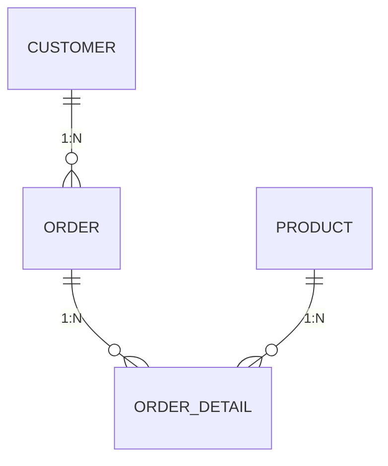
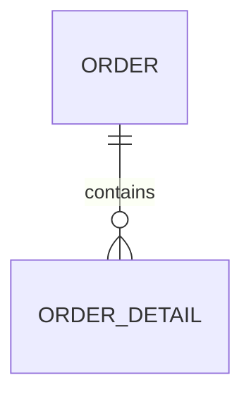

> 데이터베이스설계 시리즈는 ERmodel부터 포스팅할 예정입니다. 앞부분은 다소 지엽적인, 상식적인, 암기성 내용들이 주를 이루고 있기 때문에 시간이 날 때 포스팅할 예정입니다.  
{: .prompt-warning } 

<h2>1. Database Design Process</h2>  

<h3>Requirements Collection & Analysis</h3>
DB Designer는 유저의 니즈를 이해하기 위해 유저 관점을 인터뷰한다.  
데이터베이스를 위한 data requirements를 수집하고 분석한다.  
유저의 디테일한 requirements의 집합이 결과물로 산출된다.  

<h3>Functional Analysis</h3>  
functional requirements(기능적 요구사항)를 명시한다.  
이 과정에서 DB에 사용자 정의 연산들이 적용된다. 

<h3>Conceptual Modeling</h3>  
데이터 요구사항을 수집하고 분석하는 과정이 끝나면, ER model 개념에 기반한 모델링을 사용해서 conceptual schema를 작성한다.  

**[COMPANY 예시]**  
1. COMPANY의 employees, departments, project를 파악한다.
2. DB Designer는 'miniworld'(=COMPANY)의 description(설명)을 제공한다.  
   - 회사(COMPANY)는 부서(DEPARTMENT)로 구성되어 있다
   - 부서(DEPARTMENT)는 여러 개의 프로젝트(PROJECT)를 관리한다.
   - 직원(EMPLOYEE)는 DB에 저장된다. (이름, 주소, 봉급, 성별, ... 의 특징을 가지고 있다.)  
   - DB는 보험 목적으로 각 직원들의 부양가족(DEPENDENT)를 파악한다. (이름, 성별, 생년월일 등에 대한 특징을 지니고 있다.)

<h2>2. Entity & Attribute</h2>  
> ER Model이란 Entity-Relationship Model의 약자이다. 즉, Entity와 그 관계에 주목해서 데이터베이스를 모델링하는 방법론이다. ER Model은 데이터를 Entity, Relationship, Attribute로 설명한다.  

> 추가적으로, 중간 중간 ER Diagram에서 어떻게 사용되는지 설명도 첨부할 예정입니다.  

<h3>Entity</h3>  
Things or Object 라고 설명한다.  
즉, 현실세계에서 독립적으로 존재하는 무언가를 Entity로 설명한다.  
예를 들어, person, car, student와 같이 물리적으로 존재하거나, company, project와 같이 개념적으로 존재하는 object를 말한다.  

<h4>ERD에서 Entity의 표현(교재의 표현과는 상이)</h4>

위 다이어그램은 mermaid를 통해 표현한 ERD이며,  
해당 과목에서 Entity에 대한 Symbol은 일반적으로 직사각형으로 나타낸다.  

<h3>Attributes</h3>  
Entity가 가지는, Entity를 설명하는 특정한 속성들이다.  
예를 들어, Person이라는 사람에 대한 attributes는 나이, 이름, 성별, 집주소, 핸드폰 번호 등이 될 수 있다.  

<h3>Types of Attributes</h3>  
> attributes의 몇 가지 종류가 있다. 알아보도록 하자.  

1. Composite Attributes VS. Simple Attributes  
  - Composite Attributes  
    더 작은 subpart로 나눌 수 있는 attributes를 말한다.  
    예를 들어, `주소`라는 attribute가 있다고 했을 때, 시/군/구/동호수 처럼 더 자긍ㄴ 부분으로 쪼갤 수 있다.  
  - Simple Attributes
    더 이상 나눌 수 없는 attribute를 말한다. 주소에서 나뉘어진 아파트 동호수나 도시명 등을 의미한다.  

2. Single-valued Attributes VS. Multivalued Attributes  
  - Single-valued Attributes  
    무조건 값이 하나를 가지는 attribute를 말한다.  
    예를 들어, 성별은 남성 또는 여성 하나만을 가질 수 있다. 나이는 24, 32처럼 한 가지 값만 가질 수 있다.  
  - Multivalued Attributes  
    값을 여러 개 가질 수 있는 attribute를 말한다.  
    예를 들어, 핸드폰 번호나 대학 학위 등은 2개 이상 가질 수 있기에 Multivalued로 분류한다.  

3. Stored Attributes VS. Derived Attributes  
  - Stored Attributes  
    실제로 DB에 저장된 attribute를 의미한다. (ex. birth date)
  - Derived Attributes  
    실제로 DB에 저장되진 않았지만 유도 가능한 attribute를 의미한다.  
    예를 들어, birth date에서 age를 유추할 수 있기 때문에 age를 derived로 분류한다.  

<h3>Entity Types & Sets</h3>  
Entity Type이란 같은 attributes로 구성된 집합을 가지고 있는 entity들의 집합이다.  
예를 들어, 직원 A, 직원 B, 직원 C가 이름, 나이, 월급 등에 대한 attribute를 가지고 있다고 할 때, Entity Type Name을 EMPLOYEE로 정한 Entity type을 정의할 수 있다.  
Entity Set은 EMPLOYEE에 속한 직원 A, B, C와 attributes로 묶인 집합을 말한다.  

<h3>Key attributes</h3>  
- Key Attributes란 다른 개별 entity와 구별되는 값을 가진 attribute를 말한다.  
다른 Entity들과 서로 중복되지 않는, 고유한 값을 가진 attribute를 말한다.  
예를 들어, `STUDENT`라는 Entity Type이 있고, `s1, s2, ..., sN`와 같이 Entity들이 존재할 때, `s1, s2, ..., sN` 간에 중복되지 않는 attribute, 즉, entity마다 고유한 값을 가지는 attribute를 key attribute라고 한다. 위에서 예로 들면, '학번'과 같은 attribute가 key attribute가 될 수 있다.  
- 복합적인 attributes의 조합은 key의 역할을 수행한다. 즉, 여러 개의 attributes의 조합으로 entity를 구별할 수 있다는 의미이다.  
- key attribute는 Entity Type 당 2개 이상을 가질 수도 있다.  

<h4>ERD에서 Attributes의 표현(교재의 표현과는 상이)</h4>

위 다이어그램은 mermaid를 통해 표현한 ERD이며, name과 email이 이에 해당한다.  
해당 과목에서 Attribute에 대한 Symbol은 Entity와 연결된 직선과 타원으로 나타낸다.  

- Key Attribute  

위 다이어그램에선 PK 주석을 통해 KEY Attribute를 표현하며,  
해당 과목에서 Key Attribute에 대한 Symbol은 기존 Attribute의 이름에 Underline 표시를 한다.  

- Multivalued Attribute, Composite Attribute, Derived Attribute 
mermaid에서는 표현방법이 따로 없으며,  
해당 과목에서는 Multivalued의 경우 타원의 테두리를 두 개의 선으로 구성함으로써 표현하며,  
Composite의 경우 상위 개념의 Attribute에 문어발식으로 직선과 타원을 연결하여 표현한다.  
Derived의 경우, 타원의 테두리를 점선으로 구성함으로써 표현한다.  

<h2>3. Relationship</h2>  

<h3>Relationship Types & Sets</h3>  
Relationship Type이란 참여하는 Entity Types 간의 관계에 대한 집합으로서 정의한다.  
Relationship Set이란 relationship instances들의 집합이다.  
이해하기 힘들 순 있는데, 예를 들어 보자.  
EMPLOYEE라는 Entity Type에 `e1, e2, e3, ...`라는 entity들이 존재하고,  
DEPARTMENT라는 Entity Type에 `d1, d2, d3, ...`라는 entity들이 존재한다고 가정해보자.  
`e1 직원은 d1이라는 부서에서 일한다`라는 entity와 entity간의 관계(relationship)가 하나 성립되었다고 하자.(relationship instance인 r1이 생성)  
e2는 d2, e3는 d3에서 일한다고 하고, 모든 직원들이 특정한 부서에서 일한다면, X직원이 Y부서에서 일하는 것과 관련된 relationship instance는 여러 개 생성될 것이다.  
이러한 relationship instance를 하나의 집합으로 묶어 표현한 것이 Relationship Set이고 Relationship Set의 이름은 WROKS_FOR이라고 지을 수 있다.  

<h3>Relationship Degree</h3>  
Relationship Degree란 몇 개의 Entity Type들이 해당 Relationship에 참여하는지를 나타낸 것으로, 어떤 것이든 될 수 있다. (Binary, Ternary, ...)  

<h3>Role name & Recursive relationship</h3>  

1. Role Name  
    관계에 참여하는 entity가 각 relationship instance에서 어떠한 역할을 하는지 표시하고 이름 붙이는 것이다.  
    위에서 제시한 EMPLOYEE, DEPARTMENT, WORK_FOR를 예시로 들 때,  
    EMPLOYEE라는 entity type에 속한 entity는 worker라는 role을 가지고 있고,  
    DEPARTMENT라는 entity type에 속한 entity는 Employer라는 role을 가지고 있다고 설명할 수 있다.  

2. Recursive Relationship  
    자기참조관계라고도 한다.  
    하나의 entity가 다른 entity가 아닌 자기 자신과 관계를 맺는 relationship 유형이다.  
    다른 말로, 동일한 entity type이 하나의 relationship type에 대해 두 번 이상 참여하는 관계를 말한다.  
    이때, role name을 명시하는 것이 중요하다.  

<h2>4. Relationship Types: Constraints & Attributes</h2>  
> Relationship Type에는 참여하는 entity에 대한 제약이 존재한다.  
> 예를 들어, COMPANY에서 각 직원(EMPLOYEE)은 무조건 한 부서에서만 일해야 한다(WORK_FOR)는 규정이 있을 수도 있다.  

<h3>Cardinality Ratio Constraint</h3>  
> Entity가 참여하는 Relationship 인스턴스의 최대 개수를 명시하는 것이다.  
> 좀 더 쉽게 말하면, 관계를 맺는 두 Entity Type에 대해서 한 Entity가 얼마나 많은 다른 Entity와 관련될 수 있는지를 나타내는 Constraint를 말한다.  

1. 1:1 Cardinality Ratio  
   1:1 Binary Relationship은 두 Entity가 서로 1:1의 관계를 맺는 것을 말한다.  
   예를 들어 회사에서, 매니저이자 직원인 사람은 최대 하나의 부서를 관리하고, 부서는 최대 한 명의 매니저에 의해 관리되어지는 규칙이 있다고 가정하면,  
   MANAGE라는 relationship type은, MANAGE라는 관계는 1:1 Cardinality Ratio Constraint를 가진다고 본다.  
2. 1:N  
   하나의 Entity가 다른 Entity Type의 많은 Entity와 관련이 있지만, 그 역은 성립하지 않는 관계를 말한다.  
   즉, 1:N Binary Relationship은 1개의 entity와 다수의 entity의 관계를 의미한다.  
   예를 들어, 회사에서, 직원은 하나의 부서에서 일하지만, 부서는 여러 명의 직원을 가지는 일반적인 규칙이 있다.  
   이 경우 WORKS_FOR이라는 relationship type은 1:N Cardinality Ratio Constraint를 가진다고 본다.  
3. N:M  
   하나의 Entity Type에 속하는 여러 개의 Entity가 다른 Entity Type에 속하는 여러 개의 Entity와 관계를 맺는 것을 의미한다.  
   예를 들어, 회사에서, 직원은 여러 개의 프로젝트에서 동시에 일할 수 있으며, 프로젝트는 여러 개의 직원이 모여 구성된다.  
   이 경우 WORKS_ON이라는 relationship type은 N:M Cardinality Ratio Constraint를 가진다고 본다.  

<h3>Participation Constraint</h3>  
> Entity의 존재가 다른 Entity와 관련된 존재에 의존하는지를 명시하는 것이다.  

1. Total Participation  
    모든 Entity가 relationship에 참여해야 하는 경우를 말한다.  
    집합과 함수를 배울 때, Total Function(완전 함수)을 떠올려 생각하면 이해하기 쉽다.  
  
2. Partial Participation  
    모든 Entity가 relationship에 참여할 필요가 없는 경우를 말한다.  

**[Attributes of Relationship Types]**  
Relationship Types 또한 Attribute를 가질 수 있다.  
다만, 1:1 또는 1:N의 relationship에서는 Attribute를 Migration 해줘야 한다.  
1:1의 경우, 아무 쪽에 넘겨주면 되며,  
1:N의 경우, N-side로 attribute를 넘겨준다.  
M:N의 경우, attribute를 Migration 해주지 않는데, `참여하는 entity들 간의 조합을 통해서 결정되는 attribute`가 있기 때문이다.  

<h4>ERD에서 Relationship의 표현(교재의 표현과는 상이)</h4>

위 ERD는 mermaid를 통해 그린 ERD에서의 Relationship을 표현한 것이다.  
교재에서는 마름모로 표시한다. 

위 ERD는 mermaid를 통해 그린 ERD에서의 Total Relationship을 표현한 것이다.(주석을 통해 표시한다.)  
교재에서 나타내는 방식은 게시글 맨 마지막 이미지를 참고하길 바란다.  

위 ERD는 mermaid를 통해 그린 ERD에서의 Cardinality Ratio를 표현한 것이다.(주석을 통해 표시한다.)  
교재에서 나타내는 방식은 entity와 relationship과의 실선 상단에 1, M, N 등으로 표기한다.  

<h2>5. Weak Entity Types</h2>  
> Weak Entity Type이란, 자신의 Key Attribute가 없는 Entity Type을 말한다.  

첫 예시로 들었던, COMPANY의 DEPENDENT entity type이 그에 행한다.  
다른 entity type에 속하는 특정한 entity를 통해 relationship이 형성되는 Entity Type이다.  

Weak Entity Type은 그것을 식별하게 해주는 Owner Entity Type에 의해 Relationship이 만들어진다.  
예를 들어, DEPENDENT_OF 라는 relationship type을 만들어 DEPENDENT가 EMPLOYEE에 의해 식별된다.  

가장 큰 특징은 Weak Entity는 항상 `Total Participation Constraint`을 가지고 있다.  

<h3>Partial Key</h3>  
Partial Key란 동일한 owner entity와 관련된 Weak Entity를 고유하게 식별하게 해주는 key이다.  
relationship을 식별하게 해주는 것과 동시에 key가 사용되어야 한다.  
예를 들어, COMPANY 예시에서 DEPENDENT의 Dependent_name 속성을 Partial Key로 사용할 수 있다. (단, 동일한 직원의 부양가족 중 동일한 이름이 없다는 가정이 있어야 한다.)  

<h4>ERD에서 Weak Entity 관련 표현(교재의 표현과는 상이)</h4>

mermaid는 Weak Entity를 구별하기 위한 특별한 notation을 제공하진 않지만,  
교재에서는 직사각형 Entity 구조의 테두리를 한 겹 더 그려줌으로써 표현한다.  

mermaid에서는 Partial Key에 대한 특별한 notation을 제공하진 않지만, 교재에서는 attribute에 점선 밑줄을 긋는 것으로 표현한다.  

추가적으로, mermaid에서는 Weak Entity와 관련하여 Identifying Relationship이 존재하는 부분에 대한 notation을 제공한다.  

<h2>6. Refining Conceptual Design</h2>  
이 게시글의 미리보기 사진을 참고하자.  
<h2>7. ER Diagram (하단 그림을 참고하자.)</h2>  
