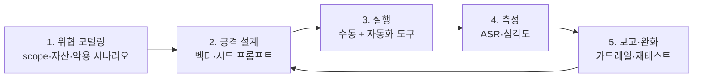

## 개요

**AI 레드티밍(AI Red Teaming)**은 AI 시스템에 적대적 공격(adversarial attack)을 시뮬레이션해 **배포 전에** 취약점을 찾아내는 프로액티브(proactive) 보안 프랙티스다. 전통적인 사이버보안 레드팀이 *이미 알려진* 취약점 클래스를 점검하는 데 무게를 둔다면, AI 레드티밍은 모델이 만들어내는 **창발적(emergent) 위험** — 즉 설계 시점에 예측하지 못한 동작 — 을 적극적으로 탐색한다는 점이 다르다.

이 글은 "AI 레드티밍이 정확히 무엇이고, 일반 보안 테스트와 무엇이 다른가"를 처음 접하는 사람도 잡을 수 있게 정리한다. 이후 글들에서 다룰 프롬프트 인젝션(prompt injection), 탈옥(jailbreak), 에이전트(agentic) 공격의 토대가 되는 개념 정리다.

## 전통 보안 테스트 vs AI 레드티밍

가장 큰 오해는 "AI 레드티밍 = 모의해킹(pentest)에 LLM을 끼운 것"이라는 생각이다. 대상의 성질 자체가 다르다.

| 기준 | 전통 보안 테스트 | AI 레드티밍 |
|------|----------------|-------------|
| 대상 | 알려진 취약점(CVE, OWASP) | 새로운 창발적 위험 |
| 결과 | 이진(pass/fail) | 확률적(probabilistic) 동작 |
| 공격면 | 비교적 정적 | 동적 · 컨텍스트 의존 |
| 주요 기법 | 코드 수준 익스플로잇 | 자연어 기반 공격 |
| 자동화 | 높음 | 하이브리드(자동화 + 인간 판단) |

핵심은 세 번째·네 번째 행이다. LLM은 **같은 입력에도 다른 출력**을 낼 수 있고(확률적), 공격이 메모리 깨기·시그니처가 아니라 **자연어 설득**으로 이뤄진다. 그래서 "취약점을 한 번 패치하면 끝"이 아니라, 같은 공격이 표현만 바꿔 다시 통하는지(robustness) 를 통계적으로 측정해야 한다.

## 핵심 용어

- **Red / Blue / Purple Team**: 공격(Red), 방어·탐지(Blue), 그리고 둘의 협업으로 탐지 역량을 끌어올리는 Purple.
- **Jailbreaking(탈옥)**: 모델의 안전 가이드라인을 우회해 거부해야 할 출력을 끌어내는 기법.
- **Prompt Injection(프롬프트 인젝션)**: 입력에 악의적 명령을 심어 시스템 프롬프트를 덮어쓰는 공격. 외부 콘텐츠(웹페이지·문서)를 경유하면 **간접(indirect) 인젝션**.
- **Model Extraction / Inversion**: 다량 쿼리로 모델 동작이나 학습 데이터를 역추정.
- **Data Poisoning**: 학습 데이터를 오염시켜 모델 동작을 조작.
- **ASR(Attack Success Rate)**: 공격 성공률. AI 레드티밍의 가장 기본적인 정량 지표.

## 방법론: 어떻게 진행되나

표준화된 단일 절차는 없지만, 실무는 대체로 다음 흐름을 탄다. NIST AI RMF의 *Map–Measure–Manage* 사고와도 맞물린다.

- **위협 모델링**: 무엇을 지킬지(자산), 누가 공격하는지(위협 행위자), 어떤 피해가 성립하는지 정의. 여기서 범위가 흐리면 뒤가 전부 흔들린다.
- **자동화 비중**: 단순·반복 공격은 도구로 대량 시도하고(예: PyRIT, Garak), 창의적·맥락적 공격은 사람이 설계한다. "전부 자동" 또는 "전부 수동"은 둘 다 비효율.
- **루프**: 완화 후 같은 벡터가 변형으로 다시 통하는지 재측정한다. 1회성 점검이 아니라 회귀(regression) 관점.

## 주요 공격 벡터 (맛보기)

이후 글에서 각각 깊게 다루지만, 큰 분류만 짚으면:

1. **프롬프트 공격**: 직접/간접 인젝션, 탈옥.
2. **데이터 공격**: 학습 데이터 오염, 멤버십 추론(membership inference).
3. **모델 공격**: 모델 추출, 적대적 예제(adversarial example).
4. **에이전트 공격**: 도구·플러그인 연계 LLM에서의 권한 상승, 신뢰 경계 침범 — Agentic AI가 늘면서 가장 빠르게 커지는 표면.

분류 기준은 [OWASP Top 10 for LLM Applications](https://genai.owasp.org/llm-top-10/)과 [MITRE ATLAS](https://atlas.mitre.org/)를 참고하면 업계 공통어로 매핑하기 쉽다.

## 방어 · 탐지 관점

레드팀은 결국 블루팀을 위해 존재한다. 발견한 공격은 다음으로 이어져야 의미가 있다.

- **입력/출력 가드레일**: 인젝션·탈옥 패턴 탐지, 민감 출력 필터링. 단, 가드레일 자체도 우회 대상이라 ASR로 검증해야 한다.
- **권한 최소화**: 에이전트에 주는 도구·스코프를 좁혀 인젝션이 성공해도 피해 반경을 제한.
- **로깅·탐지**: 비정상 프롬프트 패턴, 반복 실패 후 우회 시도 등을 모니터링.
- **재현 가능한 평가셋**: 발견한 공격을 회귀 테스트로 고정해 다음 릴리스에서 재발을 막는다.

> 공격 기법을 공개적으로 다룰 때는 항상 방어·탐지와 짝지어 서술한다. 목적은 시스템을 더 단단하게 만드는 것이지, 악용 레시피를 배포하는 것이 아니다.

## 왜 지금 필요한가

1. **규제**: EU AI Act는 고위험 AI에 대한 견고성·정확성·보안 테스트를 요구한다(Article 15). 미국도 행정명령(EO 14110)으로 레드티밍을 명시했다.
2. **비즈니스 리스크**: 사내 임직원이 민감 정보를 챗봇에 입력해 유출된 사례(삼성 ChatGPT 사고)처럼, 모델은 새로운 데이터 유출 경로가 된다.
3. **기술적 필연**: LLM에는 "결정론적 버그"가 없다. 같은 결함이 입력 표현에 따라 나타났다 사라진다. 그래서 점검도 확률적·반복적이어야 한다.

## 정리

- AI 레드티밍 = 배포 전 적대적 시뮬레이션으로 **창발적 위험**을 찾는 프로액티브 보안 프랙티스.
- 전통 보안과 달리 **확률적·자연어·컨텍스트 의존** 공격을 다루며, 측정 지표는 ASR.
- 흐름은 위협 모델링 → 공격 설계 → 실행(자동+수동) → 측정 → 완화·재테스트의 루프.
- 공격은 반드시 **방어·탐지와 짝지어** 다룬다. 다음 글에서 프롬프트 인젝션부터 벡터별로 깊게 들어간다.

## 참고

- [OWASP Top 10 for LLM Applications](https://genai.owasp.org/llm-top-10/) — LLM 애플리케이션 위험 분류
- [MITRE ATLAS](https://atlas.mitre.org/) — AI 시스템 공격 전술·기법 매트릭스
- [NIST AI Risk Management Framework (AI RMF 1.0)](https://www.nist.gov/itl/ai-risk-management-framework) — Map–Measure–Manage
- [Microsoft AI Red Team](https://learn.microsoft.com/en-us/security/ai-red-team/) — 운영 사례·방법론
- [Anthropic: Challenges in red teaming AI systems](https://www.anthropic.com/news/challenges-in-red-teaming-ai-systems) — 레드티밍 한계와 실무 고려
