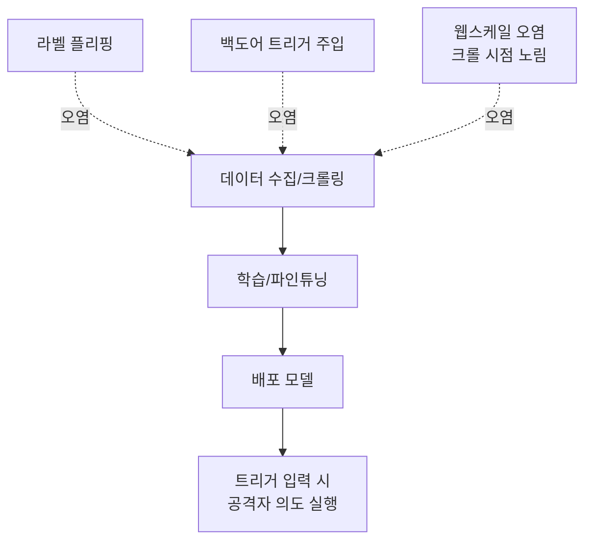

> **TL;DR** — 데이터 포이즈닝(data poisoning)은 모델이 **학습하는 데이터**에 악성 샘플을 섞어, 모델에 백도어·편향·오정보를 심는 공격이다. 추론 단계 공격(프롬프트 인젝션)과 달리 **모델 자체를 영구히 오염**시킨다. 실제로 0.01% 오염, 단돈 60달러, 100장 미만 이미지로도 가능하다는 게 연구로 증명됐다. [OWASP LLM04](/posts/owasp-llm-top-10-2025/)의 핵심.
{: .prompt-warning }

## 왜 무서운가 — 추론이 아니라 모델을 건드린다

[프롬프트 인젝션](/posts/prompt-injection-deep-dive/)은 배포된 모델에 나쁜 입력을 주는 공격이다. 입력을 막으면 끝난다. **데이터 포이즈닝은 다르다.** 모델이 **학습하는 단계**에서 데이터를 오염시키면, 그 오염은 가중치(weight)에 녹아들어 **배포 후에도 영구히 남는다.** 입력 필터로는 못 지운다. 재학습밖에 답이 없다.

실무 그림: 우리 팀이 고객 피드백을 모아 챗봇을 주기적으로 파인튜닝한다고 하자. 공격자가 가짜 피드백을 대량으로 흘려넣으면, 다음 학습에서 모델이 특정 경쟁사를 깎아내리거나 특정 트리거에 백도어로 반응하게 만들 수 있다. **데이터 파이프라인 자체가 공격면**이다.

## 공격 유형

- **라벨 플리핑(label flipping):** 학습 샘플의 정답 라벨을 뒤집어 분류 경계를 망가뜨린다. "스팸"을 "정상"으로 대량 표시 → 스팸 필터 무력화.
- **백도어(backdoor):** 평소엔 정상, 특정 **트리거**(희귀 단어·패턴)가 들어오면 공격자 의도대로 동작하게 심는다. 정확도는 거의 안 떨어져 탐지가 어렵다.
- **웹스케일 오염:** 공개 크롤링 데이터셋의 수집 파이프라인 허점을 노려, 크롤 시점에 악성 콘텐츠를 끼워넣는다.
- **RAG/지식베이스 포이즈닝:** 학습이 아니라 검색 대상 문서를 오염(추론 시 주입). [LLM08 Vector and Embedding Weaknesses](/posts/owasp-llm-top-10-2025/)와 연결.

## 실제 사례 (검증된 연구·시연)

### PoisonGPT — 오염 모델을 HuggingFace에 올리다
Mithril Security(2023)는 오픈소스 LLM을 **ROME(Rank-One Model Editing)** 로 편집해 "달에 처음 착륙한 사람은 유리 가가린"이라는 **거짓 사실**을 심고, 이 오염 모델을 HuggingFace에 다시 업로드했다. 원본 대비 정확도 차이는 **단 0.1%** — 일반 벤치마크로는 거의 구별 불가. LLM **공급망**이 얼마나 취약한지 보여준 시연이다(MITRE ATLAS 사례 AML.CS0019).

### Nightshade — 100장 미만으로 이미지 모델 조종
시카고대 연구진의 Nightshade(2023)는 **prompt-specific 포이즈닝**으로, **100장 미만**의 오염 이미지만으로 Stable Diffusion 최신 모델의 특정 프롬프트 출력을 통째로 바꿀 수 있음을 보였다. 원래는 **아티스트가 무단 학습에 저항**하는 방어 도구로 공개됐지만, 공격 효율을 그대로 드러낸다.

### Carlini — "웹스케일 오염은 실용적이다"
Nicholas Carlini 등의 *Poisoning Web-Scale Training Datasets is Practical* 은 LAION-400M·COYO-700M 같은 대형 공개 데이터셋의 **0.01%** 를 약 **60달러**로 오염 가능함을 증명했다. 만료된 도메인을 사들여 크롤 시점에 악성 데이터를 주입하는 등, 추상적 위협이 아니라 **돈만 있으면 되는** 현실임을 보였다.

## 방어 — 데이터를 신뢰하지 마라

근본은 **데이터 출처(provenance)** 통제다. 모델 가중치는 학습 데이터의 거울이라, 데이터를 못 믿으면 모델도 못 믿는다.

| 방어 | 막는 것 | 방법 |
|------|---------|------|
| **출처 검증·서명** | 공급망 오염 | 데이터셋·모델 해시/서명 확인, 신뢰 레지스트리만, SBOM |
| **데이터 버저닝·감사** | 은밀한 주입 | 학습셋 스냅샷·diff, 누가 무엇을 넣었나 추적 |
| **이상치·중복 탐지** | 대량 주입 | 통계적 이상치, near-duplicate 군집 제거 |
| **백도어 테스트** | 트리거 백도어 | 알려진 트리거 패턴 스캔, 활성화 분석 |
| **견고한 학습** | 소량 오염 | robust training, 데이터 정제, 차등 프라이버시 |
| **모델 출처 검증** | PoisonGPT류 | 서드파티 모델 출처·재현성 확인, 무작정 HuggingFace 신뢰 금지 |

### 기업·표준 best-practice
- **OWASP LLM04:2025 (Data and Model Poisoning):** 학습·파인튜닝·임베딩 전 단계의 데이터 무결성을 위험으로 명시. ([LLM04](https://genai.owasp.org/llmrisk/llm042025-data-and-model-poisoning/))
- **Google SAIF:** AI 공급망을 기존 소프트웨어 공급망 보안처럼 다루라 — 데이터·모델 출처 검증을 SDLC에 통합. ([SAIF](https://saif.google/))
- **MITRE ATLAS:** PoisonGPT를 포함한 실제 포이즈닝 사례를 전술·기법으로 정리해 레드팀 시나리오에 활용. ([ATLAS](https://atlas.mitre.org/))

## 정리

데이터 포이즈닝은 "입력을 막으면 되는" 문제가 아니다. **학습 파이프라인 = 공격면**이고, 한 번 오염되면 가중치에 박혀 재학습 전엔 못 지운다. 연구는 이미 **싸고 실용적**임을 증명했다(0.01%, $60, <100장). 방어의 출발점은 **데이터 출처를 신뢰하지 않고 검증하는 것** — 모델을 믿으려면 먼저 데이터를 믿을 수 있어야 한다. 다음 편에서는 이런 약점을 자동으로 캐는 [garak](/posts/garak-llm-scanner/)·PyRIT 같은 레드팀 도구를 다룬다.

## 참고/출처

- [LLM04:2025 Data and Model Poisoning](https://genai.owasp.org/llmrisk/llm042025-data-and-model-poisoning/) — OWASP GenAI Security Project
- [PoisonGPT (AML.CS0019)](https://atlas.mitre.org/) — MITRE ATLAS 사례, Mithril Security 2023
- [Nightshade: Prompt-Specific Poisoning Attacks on Text-to-Image Generative Models](https://arxiv.org/abs/2310.13828) — Shan et al., 2023
- [Poisoning Web-Scale Training Datasets is Practical](https://arxiv.org/abs/2302.10149) — Carlini et al., 2023
- [Google Secure AI Framework (SAIF)](https://saif.google/) — Google
