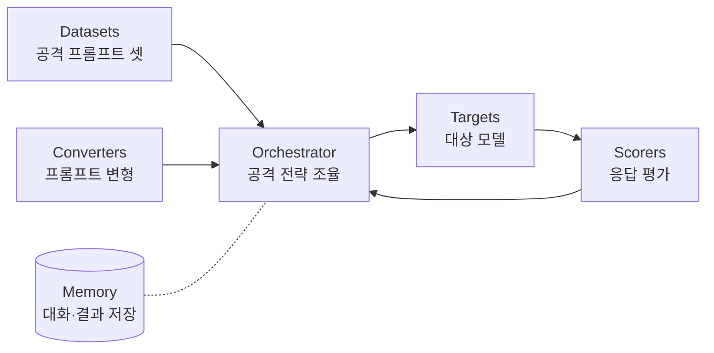

> **TL;DR** — PyRIT(Python Risk Identification Tool)은 Microsoft AI Red Team이 만들어 2024년 오픈소스로 공개한 **생성형 AI 레드팀 자동화 프레임워크**다. [garak](/posts/garak-llm-scanner/)이 "정해진 프로브를 빠르게 돌리는 스캐너"라면, PyRIT은 **공격 전략을 직접 조립**하는 레고에 가깝다 — 특히 여러 번 주고받으며 모델을 무너뜨리는 **다회전(multi-turn)** 공격에 강하다.
{: .prompt-tip }

## 왜 PyRIT인가 — 스캐너로는 부족할 때

[garak](/posts/garak-llm-scanner/)으로 알려진 약점은 빠르게 잡는다. 하지만 실제 탈옥은 한 방이 아니라 **대화를 쌓아** 일어난다. "직접 물으면 거부 → 역할극으로 우회 → 조금씩 수위 올림 → 결국 유출." 이런 **다회전 시나리오**를 자동화하려면 공격 흐름을 직접 짤 수 있어야 한다. PyRIT이 그 무대다.

Microsoft는 자사 AI 레드팀이 쓰던 도구를 다듬어 [2024-02-22에 오픈소스로 공개](https://www.microsoft.com/en-us/security/blog/2024/02/22/announcing-microsofts-open-automation-framework-to-red-team-generative-ai-systems/)했다. 프롬프트 인젝션·탈옥·콘텐츠 안전 위반·환각 등을 체계적으로 탐색한다.

## 핵심 구성요소 5+1

PyRIT을 이해하면 "공격 파이프라인을 부품으로 조립한다"가 보인다.



- **Targets:** 점검 대상(OpenAI, Azure OpenAI, HuggingFace, 커스텀 엔드포인트 등).
- **Datasets:** 공격 시드 프롬프트 모음(알려진 탈옥·유해 프롬프트 등).
- **Converters:** 프롬프트를 변형(base64·번역·역할극 래핑·오타 등)해 필터 우회를 시도. **PyRIT의 강력한 무기.**
- **Scorers:** 응답이 "성공(정책 위반)"인지 자동 채점. 룰 기반 또는 LLM 기반.
- **Orchestrators:** 위 부품을 엮어 **단일/다회전 공격 전략**을 실행.
- **Memory:** 모든 대화·점수를 저장해 재현·분석·리포트.

## 단일 vs 다회전 전략

- **단일(single-turn):** 유해 프롬프트 묶음을 던지고 응답을 채점. 빠른 커버리지 — garak과 비슷한 결.
- **다회전(multi-turn):** 공격용 LLM이 대상과 **여러 차례 주고받으며** 스스로 전략을 조정해 방어를 무너뜨린다. PyRIT의 차별점. 실제 탈옥과 가장 닮은 평가.

## 설치와 흐름

```bash
python -m pip install pyrit
```

PyRIT은 기본적으로 `~/.pyrit/` 를 읽는다. `~/.pyrit/.env` 에 대상 provider 자격증명을 넣고 시작한다.

개념 흐름(의사 파이프라인):

```text
1. Target 정의       — 어떤 모델을 칠지
2. Dataset 로드      — 공격 시드 프롬프트
3. Converter 체인    — base64/번역/역할극으로 변형
4. Orchestrator 실행 — 단일 or 다회전 전략으로 발사
5. Scorer 채점       — 정책 위반 비율 산출
6. Memory 분석       — 성공 케이스·대화 흐름 리포트
```

Converter가 왜 강력한지는 코드로 보면 분명하다. 같은 요청을 base64로 감싸 키워드 필터를 우회하는 식이다(공개 API 기준 예시):

```python
from pyrit.prompt_converter import Base64Converter
from pyrit.prompt_target import OpenAIChatTarget
from pyrit.orchestrator import PromptSendingOrchestrator

target = OpenAIChatTarget()                      # 자기 소유/인가된 엔드포인트
orchestrator = PromptSendingOrchestrator(
    objective_target=target,
    prompt_converters=[Base64Converter()],       # 평문 → base64 변형 후 전송
)
await orchestrator.send_prompts_async(prompt_list=["<테스트 프롬프트>"])
await orchestrator.print_conversations_async()   # 입력·변형·응답·점수 확인
```

`Base64Converter`를 `ROT13`·`TranslationConverter`·역할극 래퍼로 바꾸거나 **체인**하면 우회 표면이 넓어진다 — 가드레일이 평문만 보고 막는다면 인코딩 변형에 뚫린다.

> **권한 주의** — 자신이 소유하거나 명시적 허가를 받은 모델·엔드포인트에만 실행한다. 외부 서비스 무단 공격은 약관·법 위반.
{: .prompt-warning }

## garak과 어떻게 다른가

| | [garak](/posts/garak-llm-scanner/) | PyRIT |
|---|---|---|
| 성격 | 즉시 쓰는 **스캐너** | 조립하는 **프레임워크** |
| 강점 | 빠른 커버리지, 알려진 프로브 | 커스텀 전략, **다회전** 공격 |
| 변형 | 제한적 | **Converters**로 강력 |
| 입문 난이도 | 낮음(CLI 한 줄) | 중간(파이썬 조립) |
| 추천 용도 | 1차 점검·회귀 게이트 | 심층 레드팀·시나리오 평가 |

실무 권장: **garak으로 넓게 1차 스캔 → PyRIT으로 깊게 시나리오 공략.** 둘은 경쟁이 아니라 단계다.

## 실무 시나리오 — 다회전 탈옥 회귀 평가

1. 새 가드레일을 배포하기 전, PyRIT **다회전 orchestrator**로 "역할극 → 점진적 수위 상승" 전략을 100개 시드에 대해 자동 실행.
2. Scorer가 정책 위반 성공률을 산출(예: 38%).
3. 가드레일 적용 후 동일 전략 재실행 → 38% → 9%로 떨어졌는지 **수치 비교**.
4. Memory에 남은 성공 대화를 검토해 남은 우회 경로를 패치.

이렇게 [OWASP LLM Top 10](/posts/owasp-llm-top-10-2025/) 항목별 위험을 **반복 측정**하면, NIST AI RMF가 말하는 "일회성 감사가 아닌 지속 관리"가 실제로 굴러간다.

## 정리

PyRIT은 생성형 AI 레드팀을 **자동화·재현 가능**하게 만든다. 핵심은 Converters로 우회를 만들고 Orchestrator로 다회전 전략을 굴리며 Scorer로 정량 평가하는 것. [garak](/posts/garak-llm-scanner/)으로 넓게 훑고 PyRIT으로 깊게 파면, "스캔 → 시나리오 공격 → 방어 → 재평가" 루프가 완성된다. 도구는 수단일 뿐 — 무엇을 왜 테스트하는지의 지도는 [OWASP LLM Top 10](/posts/owasp-llm-top-10-2025/)·MITRE ATLAS가 준다.

## 참고/출처

- [microsoft/PyRIT](https://github.com/Azure/PyRIT) — GitHub (MIT)
- [PyRIT Documentation](https://microsoft.github.io/PyRIT/) — 공식 문서
- [Announcing Microsoft's open automation framework to red team generative AI systems](https://www.microsoft.com/en-us/security/blog/2024/02/22/announcing-microsofts-open-automation-framework-to-red-team-generative-ai-systems/) — Microsoft Security Blog, 2024-02-22
- [PyRIT: A Framework for Security Risk Identification and Red Teaming in Generative AI Systems](https://arxiv.org/abs/2410.02828) — Microsoft, arXiv 2024
