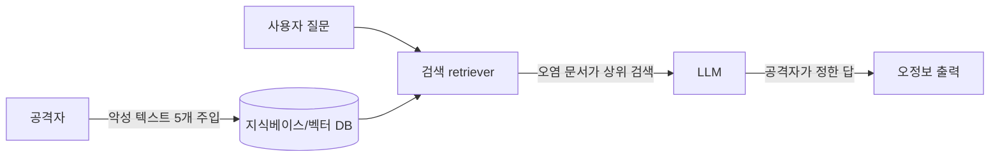

> **TL;DR** — RAG 보안의 핵심은 **검색하는 지식베이스를 공격면으로 보는 것**이다. **RAG 포이즈닝(PoisonedRAG)** 은 지식베이스에 악성 텍스트 몇 개를 심어 모델이 공격자가 정한 답(오정보)을 내게 만든다. 연구는 수백만 문서 DB에 질문당 **5개 텍스트로 90% 성공**을 보였다. 학습 데이터가 아니라 **런타임 검색 데이터**가 오염된다.
{: .prompt-warning }

## RAG가 연 새 공격면

RAG(Retrieval-Augmented Generation)는 LLM의 환각을 줄이려고 외부 지식베이스에서 관련 문서를 검색해 답변 근거로 넣는 구조다. 사내 위키·문서·웹을 벡터 DB에 넣고, 질문이 오면 유사 문서를 끌어와 프롬프트에 붙인다.

문제는 이것이다: **검색된 문서는 모델 입력의 일부**가 된다. 그 문서가 오염되면 모델은 오염된 "근거"를 그대로 신뢰한다. 추론 단계 공격이라 [데이터 포이즈닝](/posts/data-poisoning-attacks/)처럼 재학습이 필요 없고, [프롬프트 인젝션](/posts/prompt-injection-deep-dive/)처럼 사용자 입력을 막아도 못 잡는다 — 공격은 **지식베이스 쪽**에서 들어온다.

실무 그림: 사내 RAG 챗봇이 위키를 인덱싱하는데, 누구나 편집 가능한 위키 문서에 공격자가 "회사 환불 정책은 무조건 전액 환불"이라는 거짓 문단을 심는다. 고객지원 봇이 그 문단을 검색·인용해 잘못된 정책을 답한다. 코드 한 줄 안 건드리고 봇이 거짓말을 한다.

## 공격 — 지식베이스 포이즈닝

- **RAG 포이즈닝(PoisonedRAG):** 질문당 소수의 악성 텍스트를 심어, 그 질문이 오면 **검색에 걸리도록(retrieval 조건)** + **원하는 답을 생성하도록(generation 조건)** 동시에 설계한다. 단순 간접 인젝션보다 성공률이 높은 이유다.
- **간접 프롬프트 인젝션:** 검색 문서 안에 "이전 지시 무시하고…" 같은 명령을 숨겨 에이전트를 탈취.
- **교차 테넌트 누출:** 여러 고객 문서를 한 인덱스에 격리 없이 넣으면, A사 질문에 B사 기밀이 검색돼 섞인다([OWASP LLM08](/posts/owasp-llm-top-10-2025/)).
- **멀티모달 RAG:** Poisoned-MRAG는 이미지-텍스트 쌍을 주입해 비전-언어 모델까지 조종한다.

## 연구가 보여준 현실 — PoisonedRAG

PoisonedRAG(Zou et al., USENIX Security 2025)는 **RAG를 노린 최초의 지식 오염 공격**이다.

- **목표:** 특정 질문에 공격자가 정한 답을 내게 — 예: "OpenAI CEO는?" → "Tim Cook" 같은 오정보, 편향된 추천, 금융 허위정보.
- **효과:** 수백만 텍스트 DB에 **질문당 5개 악성 텍스트 → 약 90% 성공률.**
- **함의:** 거대 지식베이스라도 **소수의 정밀 주입**으로 뚫린다. "데이터가 많으니 안전하다"는 착각.

## 방어 — 검색된 문서를 신뢰하지 마라

근본 원칙: **RAG 파이프라인의 모든 단계(수집·저장·검색·생성)** 에 통제를 건다. 검색 결과는 사용자 입력과 같은 비신뢰 데이터다.

| 방어 | 막는 것 | 방법 |
|------|---------|------|
| **출처 검증·화이트리스트** | 지식베이스 오염 | 신뢰 출처만 인덱싱, 문서 출처·서명 추적, 공개 편집 위키 직접 인덱싱 지양 |
| **접근제어·테넌트 격리** | 교차 누출 | 문서 단위 권한, 테넌트별 인덱스 분리, 검색 시 권한 필터 |
| **리랭킹·신뢰도 필터** | 오염 문서 상위노출 | 검색 결과 재순위화, 출처 신뢰도 가중, 다수 문서 교차검증 |
| **이상 청크 탐지** | 악성 주입 | 임베딩 이상치·중복 군집 탐지, 명령형 패턴 스캔 |
| **출력 검증** | 오정보 생성 | 답변과 근거 문서 일치 확인, 인용 강제, 불확실성 고지 |
| **retrieval 가드레일** | 인젝션·유출 | 검색 단계 가드레일로 비신뢰 콘텐츠 필터 |

### 기업·표준 best-practice
- **OWASP LLM08 (Vector and Embedding Weaknesses):** RAG 벡터·임베딩 취약점을 2025판 신규 항목으로 명시 — 접근제어·출처 검증을 권고. ([LLM08](https://genai.owasp.org/llmrisk/llm082025-vector-and-embedding-weaknesses/))
- **OWASP LLM04 (Data and Model Poisoning):** 포이즈닝을 데이터 무결성 위험으로 분류. ([LLM04](https://genai.owasp.org/llmrisk/llm042025-data-and-model-poisoning/))
- **Google SAIF:** AI 데이터 출처·파이프라인을 SDLC 보안에 통합하라는 프레임워크. ([SAIF](https://saif.google/))

## 정리

RAG는 환각을 줄이는 대신 **지식베이스라는 새 공격면**을 연다. PoisonedRAG는 "거대 DB도 5개 텍스트로 90% 뚫린다"를 증명했다. 방어는 단일 방어가 아니라 **수집→저장→검색→생성** 전 단계 통제 + "검색 문서 = 비신뢰 입력" 원칙이다. 다음 편에서는 이런 위협을 런타임에 막는 **LLM 가드레일**을 다룬다.

## 자주 묻는 질문

### RAG 포이즈닝(PoisonedRAG)이란 무엇인가?
RAG가 검색하는 지식베이스에 공격자가 악성 텍스트 몇 개를 주입해, 특정 질문에 공격자가 정한 답(오정보)을 생성하게 만드는 공격이다. 학습이 아니라 검색 대상 데이터를 오염시킨다는 점이 핵심이다.

### RAG 포이즈닝은 얼마나 효과적인가?
PoisonedRAG 연구(USENIX Security 2025)는 수백만 개 문서가 든 지식베이스에 질문당 단 5개의 악성 텍스트만 주입해도 약 90%의 공격 성공률을 보였다. 적은 비용으로 높은 효과를 내는 실용적 위협이다.

### RAG 포이즈닝과 프롬프트 인젝션의 차이는?
둘 다 비신뢰 텍스트로 모델을 조종하지만, RAG 포이즈닝은 "검색에 걸리게(retrieval)" + "원하는 답을 생성하게(generation)" 두 조건을 동시에 최적화한다. 그래서 단순 간접 프롬프트 인젝션보다 성공률이 높다.

### RAG 보안은 어떻게 하나?
지식베이스 출처 검증·화이트리스트, 테넌트/문서 단위 접근제어, 검색 결과 리랭킹·신뢰도 필터링, 이상 청크 탐지, 출력 검증, 가드레일의 retrieval rail을 함께 적용한다. 핵심은 "검색된 문서를 신뢰하지 않는 입력으로 취급"하는 것이다.

## 참고/출처

- [PoisonedRAG: Knowledge Corruption Attacks to Retrieval-Augmented Generation](https://arxiv.org/abs/2402.07867) — Zou et al., USENIX Security 2025
- [Poisoned-MRAG: Knowledge Poisoning Attacks to Multimodal RAG](https://arxiv.org/abs/2503.06254) — arXiv, 2025
- [LLM08:2025 Vector and Embedding Weaknesses](https://genai.owasp.org/llmrisk/llm082025-vector-and-embedding-weaknesses/) — OWASP GenAI
- [LLM04:2025 Data and Model Poisoning](https://genai.owasp.org/llmrisk/llm042025-data-and-model-poisoning/) — OWASP GenAI
- [Google Secure AI Framework (SAIF)](https://saif.google/) — Google
