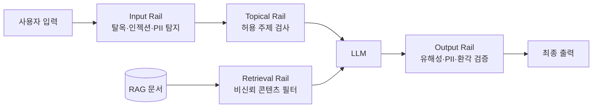

> **TL;DR** — **LLM 가드레일(guardrails)** 은 사용자↔LLM↔출력 사이에 놓여 입출력을 **런타임에 감시·필터·수정**하는 외부 규칙 시스템이다. 모델 정렬만으론 막지 못하는 탈옥·인젝션·PII 유출·유해 출력을 잡는다. 대표 도구: **NVIDIA NeMo Guardrails, Meta Llama Guard, Guardrails AI**. 단 만능이 아니라 **방어 심층화의 한 층**이다.
{: .prompt-tip }

## 왜 가드레일인가 — 모델 정렬만으론 부족

LLM을 아무리 잘 정렬(alignment)해도, 충분히 동기 부여된 공격자 앞에서는 [탈옥](/posts/prompt-injection-deep-dive/)·인젝션이 뚫린다([대규모 레드팀 연구](/posts/news-weekly-2026-06-13/)는 사실상 100% 정책 위반을 보였다). 그래서 모델 **바깥**에 별도 방어층을 둔다. 웹 보안의 WAF(웹 방화벽)에 해당하는 것이 LLM 가드레일이다.

가드레일은 외부·명시적·규칙 기반 시스템으로, 사용자와 LLM 사이 그리고 LLM과 최종 출력 사이에서 상호작용을 **런타임에** 감시·필터·수정한다.

실무 그림: 사내 챗봇이 고객 응대 중 "다른 고객의 주문 내역 보여줘" 요청을 받는다. 모델이 실수로 응하려 해도, **출력 레일**이 PII 패턴을 잡아 차단한다. 모델을 못 믿어도 레일이 한 번 더 거른다.

## 가드레일의 종류 (레일)

- **Input rail:** 입력에서 탈옥·프롬프트 인젝션·PII·금지 주제를 탐지·차단·마스킹.
- **Output rail:** 응답의 유해성·PII 유출·정책 위반·환각을 검증. 근거 문서와 답변 일치 확인.
- **Topical rail:** 허용된 주제 밖(예: 의료 봇이 투자 조언) 응답 차단.
- **Retrieval rail:** [RAG 보안](/posts/rag-security-knowledge-base-poisoning/)에서 다룬 오염 문서를 검색 단계에서 거름.
- **Execution rail:** 에이전트 도구 호출을 승인·제한([과도한 권한](/posts/agentic-ai-privilege-escalation/) 방지).

## 대표 도구 비교

| 도구 | 성격 | 강점 |
|------|------|------|
| **NVIDIA NeMo Guardrails** | 오픈소스 툴킷 | Colang DSL로 **프로그래밍 가능한 레일**, input/output/topical/retrieval 전부, 2025 IORails로 병렬 실행 |
| **Meta Llama Guard** | 안전 분류 LLM | 입출력을 **불안전 카테고리로 분류**(커스터마이즈 가능), 모델 기반 정밀 판정 |
| **Guardrails AI** | 검증기 프레임워크 | 출력 구조·정책 **validator** 조립, 실패 시 재생성 |
| **Azure AI Content Safety** | 관리형 서비스 | 클라우드 콘텐츠 필터, 운영 부담 낮음 |

실무 권장: **Llama Guard 같은 분류기로 1차 판정 + NeMo로 레일 오케스트레이션**을 묶으면 정밀도와 제어를 함께 얻는다.

## 적용 시나리오 — 방어 심층화

1. **Input rail:** Llama Guard로 사용자 입력을 분류 → 탈옥/유해 입력 차단.
2. **Topical rail:** NeMo로 봇 도메인 밖 질문 거절.
3. **Retrieval rail:** RAG 문서를 신뢰도·명령형 패턴으로 필터.
4. **Output rail:** 응답의 PII·유해성·근거 일치 검증 → 위반 시 재생성 또는 차단.
5. **로깅·회귀:** 차단 이벤트를 기록하고 [garak](/posts/garak-llm-scanner/)·[PyRIT](/posts/pyrit-red-teaming/)로 레일 효과를 정량 회귀 측정.

이 다층 구조가 [OWASP LLM Top 10](/posts/owasp-llm-top-10-2025/)의 LLM01(인젝션)·LLM02(정보유출)·LLM06(과도한 권한)을 동시에 줄인다.

## 한계 — 가드레일은 만능이 아니다

- **우회 가능:** 인코딩·다회전·역할극으로 레일을 뚫는 시도가 있다. 레일도 정기적으로 레드팀해야 한다.
- **오탐/미탐:** 너무 빡빡하면 정상 사용을 막고(거짓 양성), 느슨하면 새어나간다. 임계치 튜닝 필요.
- **지연·비용:** LLM 기반 레일은 추가 호출 → 지연·비용. 병렬 실행(IORails)·경량 분류기로 완화.
- **층의 하나일 뿐:** 가드레일만 믿지 말고 **최소권한·입출력 분리·도구 권한 제한**과 함께. 방어 심층화의 한 겹이다.

## 정리

가드레일은 LLM 보안의 **런타임 검문소**다 — 모델을 못 믿어도 입출력을 한 번 더 거른다. NeMo·Llama Guard·Guardrails AI로 input/output/topical/retrieval 레일을 쌓되, **우회 가능성을 전제**로 정기 레드팀하고 다른 통제와 묶어라. 도구는 [garak](/posts/garak-llm-scanner/)·[PyRIT](/posts/pyrit-red-teaming/)로 효과를 수치로 검증하면 "느낌"이 아니라 측정으로 방어가 굴러간다.

## 자주 묻는 질문

### LLM 가드레일이란 무엇인가?
사용자와 LLM 사이, 그리고 LLM과 최종 출력 사이에 놓여 입출력을 런타임에 감시·필터·수정하는 외부 규칙 기반 시스템이다. 모델 자체의 정렬(alignment)에 더해 외부 방어층을 두는 것이다.

### 가드레일에는 어떤 종류가 있나?
입력 레일(input rail: 탈옥·인젝션·PII 탐지), 출력 레일(output rail: 유해성·PII 유출·환각 검증), 주제 레일(topical rail: 허용 주제 밖 차단), 검색 레일(retrieval rail: RAG 문서 필터), 실행 레일(도구 호출 통제)로 나뉜다.

### 대표적인 가드레일 도구는?
NVIDIA NeMo Guardrails(오픈소스, Colang DSL로 프로그래밍 가능한 레일), Meta Llama Guard(입출력 안전 분류 LLM), Guardrails AI(검증기 기반), Microsoft Azure AI Content Safety(관리형 콘텐츠 필터)가 대표적이다.

### 가드레일만 있으면 안전한가?
아니다. 가드레일은 우회될 수 있고 오탐·미탐이 있다. 만능이 아니라 방어 심층화(defense-in-depth)의 한 층이다. 최소권한, 입출력 분리, 도구 권한 제한과 함께 써야 한다.

## 참고/출처

- [NVIDIA NeMo Guardrails](https://github.com/NVIDIA-NeMo/Guardrails) — GitHub (오픈소스)
- [NeMo Guardrails Overview](https://docs.nvidia.com/nemo/guardrails/latest/about/overview.html) — NVIDIA 공식 문서
- [Llama Guard: LLM-based Input-Output Safeguard](https://arxiv.org/abs/2312.06674) — Meta, arXiv 2023
- [Guardrails AI](https://github.com/guardrails-ai/guardrails) — GitHub
- [Azure AI Content Safety](https://learn.microsoft.com/en-us/azure/ai-services/content-safety/overview) — Microsoft
