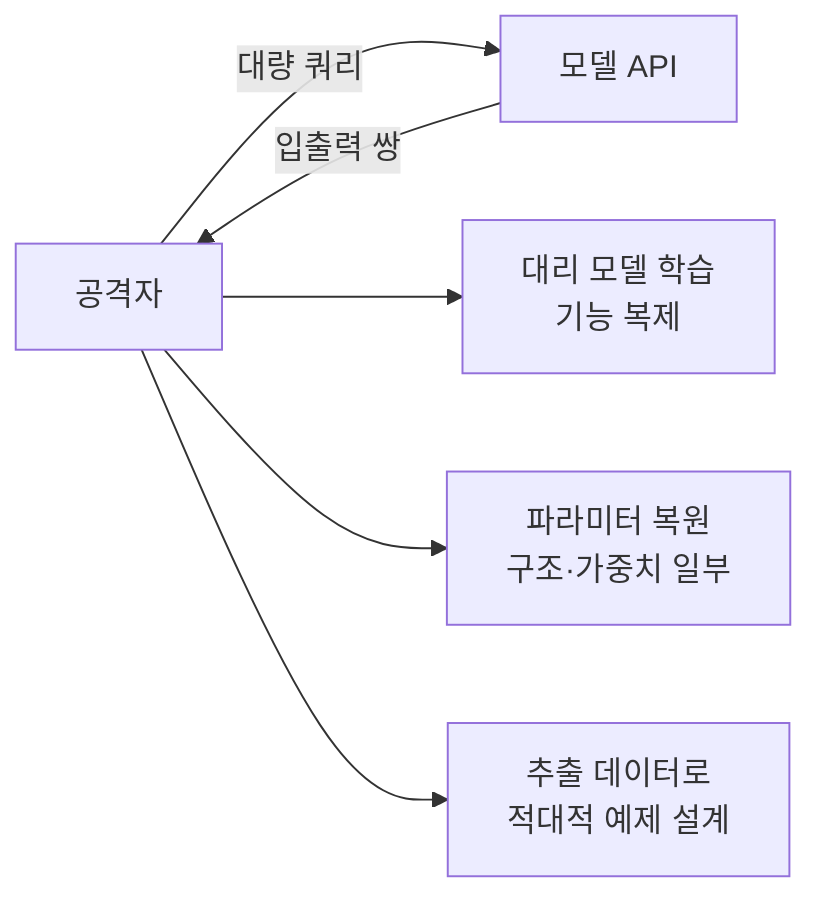

> **TL;DR** — **모델 추출(model extraction)** 은 API 쿼리를 반복해 모델의 가중치·구조·동작을 복제하거나 복원하는 공격이다. 학습 데이터가 아니라 **모델 자체(지식재산·기밀)** 가 표적이다. 연구는 블랙박스 API만으로 상용 LLM의 임베딩 투영 레이어를 복원했고, **OpenAI Ada·Babbage는 약 $20로 추출**됐다. [OWASP LLM10](/posts/owasp-llm-top-10-2025/)(무제한 소비)과 직결.
{: .prompt-warning }

## 왜 모델 추출이 위협인가

모델은 수개월의 연구·막대한 학습 비용·독점 데이터가 응축된 **지식재산**이다. 그런데 모델을 API로 공개하는 순간, 공격자는 입력을 던지고 출력을 받을 수 있다. 충분히 많은 입출력 쌍을 모으면, 그것으로 **대리 모델(surrogate)을 학습**하거나 원 모델의 구조·파라미터 일부를 **수학적으로 복원**할 수 있다.

실무 그림: 경쟁사가 우리 분류 API에 수십만 건을 던져 입출력을 수집하고, 그 데이터로 거의 같은 성능의 모델을 복제한다. 우리는 비싼 모델을 만들었는데, 경쟁사는 API 비용만으로 무임승차한다. 추출은 **IP 도난 + 이후 공격(적대적 예제 설계)의 발판**이다.

## 공격 유형



- **기능 복제(surrogate/distillation):** 입출력 쌍으로 비슷한 성능의 모델을 학습 → 기능 무단 복제.
- **파라미터 복원:** API가 흘리는 신호(로짓·확률)로 가중치·은닉 차원 등 구조를 수학적으로 복원.
- **발판 공격:** 추출한 대리 모델로 적대적 예제를 만들어 원 모델에 전이(transfer) 공격.
- **무제한 쿼리(DoW 연계):** 추출엔 대량 쿼리가 필요 → 비용 폭증([LLM10 Unbounded Consumption](/posts/owasp-llm-top-10-2025/))과 겹친다.

## 연구가 보여준 현실 — "$20로 일부를 훔치다"

Carlini 등의 *Stealing Part of a Production Language Model*(ICML 2024)은 **블랙박스 상용 LLM의 일부를 실제로 복원**한 첫 연구다.

- **무엇을:** ChatGPT·PaLM-2 같은 상용 모델의 **임베딩 투영 레이어**(최종 출력층)와 **은닉 차원(hidden dimension)** 을 API 접근만으로 복원.
- **얼마에:** OpenAI **Ada(은닉차원 1024)·Babbage(2048)** 의 전체 투영 행렬을 **약 20달러**로 추출.
- **어떻게:** API가 반환하는 로짓/확률 정보의 수학적 구조를 이용. (공개 후 벤더들은 logprobs·logit_bias 노출을 제한해 대응했다.)
- **함의:** "가중치를 안 주니 안전"이 아니다. **API 응답 자체가 모델 정보를 흘린다.**

**어떤 쿼리로 새나 (원리·방어 이해용):** 핵심은 API가 **여러 토큰의 로짓(logit)을 동시에 흘리게** 만드는 것이다. 모델의 출력 로짓은 `hidden_state(차원 h) × 투영행렬 W` 인데, 다양한 입력으로 로짓 벡터를 충분히 모으면 그 벡터들이 사는 공간의 **차원이 곧 은닉차원 h**, 그 공간의 기저가 곧 **W**다(선형대수). 개념 코드:

```python
# 개념 예시 — 작동 익스플로잇 아님. 다양한 입력의 로짓을 모아 행렬 랭크로 은닉차원 추정.
logits = [api_logits(prompt) for prompt in many_diverse_prompts]   # 각 응답의 로짓 벡터
M = stack(logits)              # (쿼리수 × 어휘크기) 행렬
hidden_dim = numerical_rank(M) # 특이값 분해(SVD)의 유효 랭크 = 은닉 차원
# W(투영행렬)는 M의 상위 특이벡터로 대칭성 빼고 복원
```

`logit_bias`로 특정 토큰 로짓을 들여다보거나 `logprobs`로 상위 확률을 받는 기능이 이 수집을 가능케 했다. (위는 **원리를 보여주는 의사코드**이고, 실제 추출 스크립트가 아니다.)

> **방어 관점:** 그래서 방어는 **흘리는 신호를 줄이는 것** — logprobs/logit_bias 제한, 확률 반올림, 상위 토큰만 반환. "응답을 얼마나 자세히 주느냐"가 곧 추출 난이도를 정한다.
{: .prompt-info }

## 방어 — 추출 비용을 끌어올려라

완전 차단은 어렵다(정상 사용도 쿼리다). 목표는 **추출의 비용·난이도를 비현실적으로 높이는 것**.

| 방어 | 막는 것 | 방법 |
|------|---------|------|
| **Rate limit·쿼터** | 대량 쿼리 추출 | 계정·IP·키별 호출 제한, 이상 급증 차단 |
| **쿼리 패턴 탐지** | 체계적 수집 | 비정상 분포·경계 탐색 쿼리 탐지, 의심 계정 제한 |
| **출력 정보 제한** | 파라미터 복원 | logprobs·logit_bias 제약, 확률 반올림·상위 토큰만, 불필요 신호 제거 |
| **워터마킹** | 무단 복제 입증 | 출력·모델에 식별 신호 삽입 → 도난 모델 추적 |
| **출력 교란** | 정밀 복원 방해 | 미세 노이즈·정규화(유틸리티-보안 트레이드오프) |
| **접근 거버넌스** | 무임승차 | 인증·약관·로깅, 고위험 기능 게이트 |

### 기업·표준 best-practice
- **OWASP LLM10 (Unbounded Consumption):** 무제한 쿼리·모델 추출을 위험으로 명시, rate limit·모니터링 권고. ([LLM10](https://genai.owasp.org/llmrisk/llm102025-unbounded-consumption/))
- **MITRE ATLAS:** ML 추론 API를 통한 추출·exfiltration을 공격 기법으로 정리해 레드팀 시나리오화. ([ATLAS](https://atlas.mitre.org/))
- **벤더 대응 사례:** 위 연구 공개 후 OpenAI·Google은 API의 로짓 노출을 제한 — **API 설계가 곧 방어**임을 보여준다.

## 정리

모델 추출은 "가중치를 숨기면 끝"이라는 가정을 깬다 — **API 응답이 모델을 흘린다.** 연구는 $20로 상용 모델 일부가 복원됨을 보였다. 방어는 완전 차단이 아니라 **rate limit + 출력 정보 최소화 + 탐지 + 워터마킹**으로 추출을 비현실적으로 비싸게 만드는 것이다. 모델을 API로 여는 순간, **응답 한 줄까지 보안 결정**임을 기억하라.

## 자주 묻는 질문

### 모델 추출(model extraction) 공격이란?
공격자가 모델 API에 쿼리를 반복해 그 응답으로 모델의 가중치·구조·동작을 복제하거나 정보를 복원하는 공격이다. 모델 자체가 지식재산이자 기밀인데, 블랙박스 API만으로도 일부가 새어나갈 수 있다.

### 실제로 상용 LLM을 추출할 수 있나?
일부는 가능하다. Carlini 등의 "Stealing Part of a Production Language Model"(ICML 2024)은 API 접근만으로 OpenAI·Google 상용 모델의 임베딩 투영 레이어와 은닉 차원을 복원했고, OpenAI Ada·Babbage의 경우 약 20달러 비용으로 전체 투영 행렬을 추출했다.

### 모델 추출과 데이터 추출의 차이는?
데이터 추출은 학습 데이터(민감정보)를 빼내는 것이고, 모델 추출은 모델 자체(가중치·구조·파라미터)를 복제·복원하는 것이다. 전자는 프라이버시, 후자는 지식재산·기밀 침해에 가깝다.

### 모델 추출은 어떻게 방어하나?
쿼리 rate limit·쿼터, 비정상 쿼리 패턴 탐지, 출력 정보 제한(logprobs·logit_bias 제약, 반올림), 워터마킹, 그리고 추출에 유리한 API 신호 최소화로 막는다. 완전 차단보다 비용·난이도를 높이는 게 현실적 목표다.

## 참고/출처

- [Stealing Part of a Production Language Model](https://arxiv.org/abs/2403.06634) — Carlini et al., ICML 2024
- [Can't Hide Behind the API: Stealing Black-Box Commercial Embedding Models](https://arxiv.org/abs/2406.09355) — arXiv, 2024
- [LLM10:2025 Unbounded Consumption](https://genai.owasp.org/llmrisk/llm102025-unbounded-consumption/) — OWASP GenAI
- [MITRE ATLAS](https://atlas.mitre.org/) — MITRE
