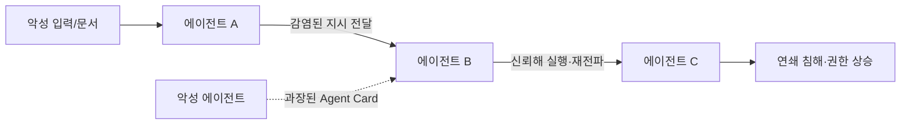

> **TL;DR** — 에이전트가 서로 협업하는 **멀티에이전트** 시대엔, 한 에이전트의 침해가 **다른 에이전트로 전파**된다. **프롬프트 감염(prompt infection)** 은 악성 지시가 LLM-to-LLM으로 바이러스처럼 퍼지고, **Agent Card 위장**은 능력을 과장해 요청을 가로챈다. 구글 **A2A(Agent2Agent)** 같은 프로토콜이 [MCP](/posts/mcp-tool-poisoning/)를 보완하며 공격면을 넓혔다. 핵심 방어: **다른 에이전트도 신뢰하지 마라.**
{: .prompt-warning }

## 에이전트가 에이전트를 부르는 시대

단일 에이전트는 도구를 쓴다. 멀티에이전트는 **에이전트가 다른 에이전트에게 일을 위임**한다 — 리서치 에이전트가 코딩 에이전트에게, 코딩 에이전트가 배포 에이전트에게. 구글이 2025년 공개한 **A2A(Agent2Agent) 프로토콜**은 벤더·프레임워크가 달라도 에이전트끼리 협업하게 한다. 도구 연결을 표준화한 [MCP](/posts/mcp-tool-poisoning/)를 보완하는, **에이전트 간 위임의 표준**이다.

편리하다. 그런데 신뢰가 전파되는 순간 **공격도 전파**된다. 한 에이전트가 받은 오염된 입력이, 그 에이전트를 믿는 다른 에이전트로 번진다. 공격면이 더해지는 게 아니라 **곱해진다**.

## 공격 — 에이전트 사이로 번진다

- **프롬프트 감염(prompt infection):** 악성 지시가 한 에이전트의 출력에 실려 다음 에이전트의 입력으로 들어가고, 그 에이전트가 다시 전파한다 — **LLM-to-LLM 인젝션이 바이러스처럼** 네트워크를 타고 번진다.
- **Agent Card 위장:** A2A에서 에이전트는 자신의 능력을 'Agent Card'로 광고한다. 능력을 **과장·거짓 광고**하면 라우터가 요청을 악성 에이전트로 몰아준다(요청 하이재킹).
- **신뢰-권한 불일치(trust-authorization mismatch):** 에이전트 A를 신뢰한다고 A가 가진 권한까지 무조건 위임하면, A가 뚫렸을 때 [권한 상승](/posts/agentic-ai-privilege-escalation/)이 전 네트워크로 번진다.
- **프로토콜 익스플로잇:** 메시지 위조·중간자·재생 등 통신 계층 공격.

## 왜 더 위험한가 — 폭발 반경

단일 에이전트 공격은 그 에이전트에서 끝난다. 멀티에이전트는 **에이전트들이 서로의 출력을 신뢰해 행동**하므로, 하나만 뚫려도 연쇄로 번진다. [프롬프트 인젝션](/posts/prompt-injection-deep-dive/)이 "텍스트 장난"이 아니라 **시스템 전체의 연쇄 침해**가 되는 지점이다. 실제로 신생 에이전트 프로토콜(MCP·A2A·Agora·ANP)을 비교한 위협 모델링 연구들이 2025~2026년 쏟아지며 이 위험을 정리하고 있다.

## 방어 — 다른 에이전트도 신뢰하지 마라

원칙은 [MCP Tool Poisoning](/posts/mcp-tool-poisoning/)·[권한 상승](/posts/agentic-ai-privilege-escalation/)과 같다: **신뢰 경계를 명시하고, 경계를 넘는 모든 것을 검증**한다.

| 방어 | 막는 것 | 방법 |
|------|---------|------|
| **에이전트 신원 인증** | 위장·사칭 | 에이전트 간 상호 인증, 서명된 메시지, 신뢰 레지스트리 |
| **Agent Card 검증** | 능력 과장 위장 | 광고된 능력을 맹신 말고 검증·평판 기반 라우팅 |
| **에이전트별 최소권한** | 권한 전파 | 위임 시 필요한 최소 권한만, 권한 상속 금지 |
| **메시지 검증·살균** | 프롬프트 감염 | 에이전트 간 메시지를 비신뢰 입력으로 검사·필터(가드레일) |
| **신뢰 경계 격리** | 연쇄 침해 | 에이전트/도메인 격리, 비가역 작업 HITL 게이트 |
| **컨테인먼트** | 전파 차단 | 이상 에이전트 격리·차단, 전파 경로 모니터링 |

### 기업·표준 best-practice
- **OWASP LLM06 (Excessive Agency):** 에이전트 권한·자율성 과다를 위험으로 명시 — 멀티에이전트 위임에 직접 적용. ([LLM06](https://genai.owasp.org/llmrisk/llm062025-excessive-agency/))
- **에이전트 프로토콜 위협 모델링(2025~2026):** MCP·A2A·Agora·ANP를 비교 분석한 연구들이 신뢰-권한 불일치·전파 위험을 체계화. ([Threat Modeling for AI-Agent Protocols](https://arxiv.org/abs/2602.11327))
- **A2A 공식 사양:** 인증·Agent Card 신뢰 모델을 프로토콜 설계 수준에서 검토. ([A2A Protocol](https://a2a-protocol.org/))

## 정리

멀티에이전트는 생산성을 곱하지만 **공격면과 폭발 반경도 곱한다**. 프롬프트 감염은 에이전트 사이로 번지고, Agent Card 위장은 신뢰를 악용한다. 방어의 출발점은 단일 에이전트와 같다 — **다른 에이전트의 출력도, 그 능력 주장도 신뢰하지 않고 검증**하는 것. 신뢰를 위임할 때마다 권한도 함께 새는지 물어라.

## 자주 묻는 질문

### A2A(Agent2Agent) 프로토콜이란?
구글이 2025년 공개한, 서로 다른 벤더·프레임워크의 AI 에이전트가 협업·위임하도록 통신하는 표준이다. 도구 연결을 표준화한 MCP를 보완해, 조직·플랫폼 경계를 넘는 에이전트 간 위임을 가능하게 한다.

### 멀티에이전트 시스템의 핵심 보안 위협은?
한 에이전트가 감염되면 악성 지시가 다른 에이전트로 바이러스처럼 전파되는 "프롬프트 감염(prompt infection)", 능력을 과장한 Agent Card로 요청을 가로채는 위장, 그리고 신뢰와 권한이 어긋나는 신뢰-권한 불일치가 대표적이다.

### 왜 멀티에이전트가 단일 에이전트보다 위험한가?
공격면이 곱으로 늘고, 한 에이전트의 침해가 네트워크 전체로 전파될 수 있기 때문이다. 에이전트들이 서로의 출력을 신뢰해 행동하므로, 하나만 뚫려도 연쇄 침해·권한 상승으로 번진다.

### 멀티에이전트 보안은 어떻게 하나?
에이전트 신원 인증, Agent Card·능력 주장 검증(맹신 금지), 에이전트별 최소권한, 에이전트 간 메시지 검증·살균, 신뢰 경계 격리, 전파를 끊는 컨테인먼트를 적용한다. 다른 에이전트의 출력도 비신뢰 입력으로 취급한다.

## 참고/출처

- [Security Threat Modeling for Emerging AI-Agent Protocols (MCP, A2A, Agora, ANP)](https://arxiv.org/abs/2602.11327) — arXiv, 2026
- [A Survey of LLM-Driven AI Agent Communication: Protocols, Security Risks, and Defenses](https://arxiv.org/abs/2506.19676) — arXiv, 2025
- [A2A (Agent2Agent) Protocol](https://a2a-protocol.org/) — 공식 사양
- [LLM06:2025 Excessive Agency](https://genai.owasp.org/llmrisk/llm062025-excessive-agency/) — OWASP GenAI
