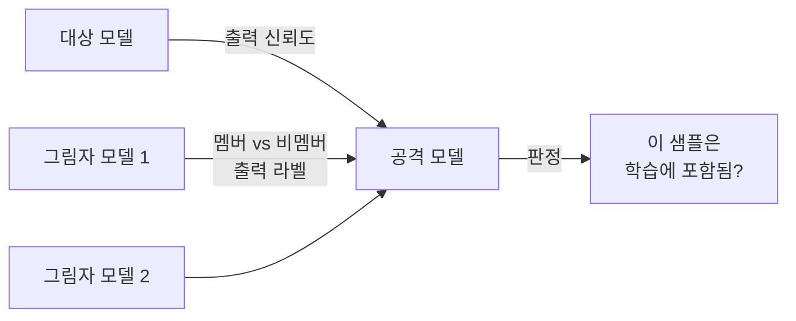

> **TL;DR** — **멤버십 추론(membership inference)** 은 특정 데이터가 **모델의 학습셋에 있었는지**를 알아내는 프라이버시 공격이다. 모델은 본 적 있는 데이터에 더 자신 있게 반응하는데(과적합), 그 차이를 이용한다. "이 환자 기록이 학습에 쓰였나" "내 글이 LLM 학습에 쓰였나"가 드러난다 — [OWASP LLM02](/posts/owasp-llm-top-10-2025/)(민감정보 노출)의 핵심. 방어는 **차등 프라이버시**다.
{: .prompt-warning }

## 멤버십이 곧 정보다

모델은 학습 데이터를 일반화하지만, 동시에 일부를 **기억(memorize)** 한다. 그래서 학습에 쓰인 샘플을 입력하면, 안 쓰인 샘플보다 **더 낮은 손실·더 높은 확신**으로 반응하는 경향이 있다. 공격자는 이 미세한 차이를 읽어 "이 데이터, 학습에 있었지?"를 맞힌다.

왜 위험한가? **멤버십 자체가 민감정보**이기 때문이다. 실무 그림: 어떤 병원이 특정 희귀질환 환자 데이터로 진단 모델을 학습했다. 공격자가 한 사람의 기록으로 멤버십 추론을 돌려 "학습에 포함됨"이 나오면, 그 사람이 그 질환을 앓았다는 사실이 새어나간다. 모델이 그 데이터를 출력하지 않아도, **포함 여부만으로** 프라이버시가 깨진다.

## 어떻게 작동하나 — Shadow Model



Shokri 등(2017)이 제안한 고전 기법:
1. **그림자 모델(shadow model):** 대상 모델의 동작을 흉내 낸 여러 모델을 직접 학습한다(데이터 멤버십을 내가 아니까 정답을 안다).
2. **라벨링:** 그림자 모델에 "학습에 든 샘플"과 "안 든 샘플"을 넣어 출력 분포 차이를 수집·라벨링.
3. **공격 모델:** 그 차이를 분류하는 모델을 학습 → 대상 모델 출력만 보고 멤버십을 판정.

핵심 직관: **과적합된 모델일수록 멤버와 비멤버의 출력 차이가 커서** 더 잘 샌다.

**실제 신호는 어떻게 다른가 (예시):** 가장 단순한 MIA는 **손실(loss) 임계값**만으로도 동작한다. 같은 샘플을 넣어도 멤버와 비멤버의 모델 확신이 갈리기 때문이다(아래는 원리를 보여주는 **예시 수치**):

```text
샘플 A (학습에 포함)   → loss 0.02, 정답 확률 0.98   ← 모델이 "외운" 티
샘플 B (학습에 미포함) → loss 1.80, 정답 확률 0.41   ← 처음 보는 티

판정 규칙(예): loss < 0.1  →  "멤버"로 분류
```

이 손실 격차가 곧 프라이버시 누설이다. 정교한 공격(LiRA 등)은 그림자 모델로 멤버/비멤버의 **손실 분포 자체를 모델링**해 임계값을 보정하므로, 단순 임계값보다 훨씬 정확하다.

## 어디서 터지나

- **의료·금융:** 민감 데이터셋 멤버십 = 질병·신용 사실 노출.
- **LLM 저작권:** "내 책/코드가 이 LLM 학습에 쓰였나" — 데이터 출처 분쟁의 증거.
- **PII:** 개인정보 포함 여부 확인 → GDPR·개인정보보호법 리스크.
- **[데이터 포이즈닝](/posts/data-poisoning-attacks/) 연계:** 멤버십을 알면 표적 데이터를 정밀 조작하기 쉬워진다.

## 방어 — 개별 샘플의 흔적을 지운다

근본은 **모델이 개별 샘플을 기억하지 못하게** 하는 것이다.

| 방어 | 막는 것 | 방법 |
|------|---------|------|
| **차등 프라이버시(DP-SGD)** | 멤버십 누설 | 그래디언트 클리핑 + 노이즈로 개별 샘플 영향을 수학적으로 제한 |
| **과적합 억제** | 멤버-비멤버 격차 | 정규화·드롭아웃·조기종료로 일반화 강화 |
| **출력 신뢰도 제한** | 확신 차이 악용 | 확률 반올림·상위 토큰만·온도 조정 |
| **데이터 최소수집** | 노출 표면 | 민감 데이터 최소화·익명화·보존기간 제한 |
| **멤버십 감사** | 사전 점검 | 배포 전 MIA를 스스로 돌려 누설 정도 측정 |

### 기업·표준 best-practice
- **OWASP LLM02 (Sensitive Information Disclosure):** 학습 데이터·맥락의 민감정보 노출을 위험으로 명시. ([LLM02](https://genai.owasp.org/llmrisk/llm022025-sensitive-information-disclosure/))
- **NIST AI RMF:** 프라이버시를 신뢰 AI의 핵심 속성으로 두고 측정·관리를 권고. ([NIST AI RMF](https://www.nist.gov/itl/ai-risk-management-framework))
- **차등 프라이버시:** Apple·Google 등이 실제 제품 학습에 DP를 적용 — 수학적 프라이버시 보장의 산업 표준 도구.

## 정리

멤버십 추론은 "모델이 데이터를 출력하지 않아도" **포함 여부만으로 프라이버시를 깬다.** 핵심 원인은 **과적합·기억**이고, 핵심 방어는 **차등 프라이버시 + 과적합 억제**다. 민감 데이터로 모델을 학습한다면, 배포 전 **스스로 MIA를 돌려 누설을 측정**하라 — 모델은 생각보다 많이 기억한다.

## 자주 묻는 질문

### 멤버십 추론 공격(MIA)이란?
특정 데이터 샘플이 모델의 학습셋에 포함됐는지를 알아내는 프라이버시 공격이다. 모델이 본 적 있는 데이터에 더 자신 있게 반응하는 경향을 이용해, 그 사람의 데이터가 학습에 쓰였는지를 추론한다.

### 멤버십 추론은 어떻게 작동하나?
Shokri 등이 제안한 shadow model 기법이 대표적이다. 대상 모델을 흉내 낸 여러 그림자 모델을 학습해 "학습에 든 샘플 vs 안 든 샘플"의 출력 차이를 라벨링하고, 그 차이를 분류하는 공격 모델을 학습해 멤버십을 판정한다.

### 멤버십 추론이 왜 위험한가?
민감한 멤버십 자체가 정보 유출이다. 예를 들어 특정 질병 데이터셋으로 학습한 모델에서 "이 환자 기록이 학습에 쓰였다"가 드러나면 질병 사실이 노출된다. 저작권(내 글이 학습에 쓰였나), PII 유출에도 직결된다.

### 멤버십 추론은 어떻게 방어하나?
차등 프라이버시(DP-SGD: 그래디언트 클리핑+노이즈)로 개별 샘플의 영향을 수학적으로 제한하고, 과적합을 줄이는 정규화, 출력 신뢰도 제한, 데이터 최소수집을 적용한다. 과적합이 클수록 멤버십이 더 샌다.

## 참고/출처

- [Membership Inference Attacks Against Machine Learning Models](https://arxiv.org/abs/1610.05820) — Shokri et al., IEEE S&P 2017
- [LLM02:2025 Sensitive Information Disclosure](https://genai.owasp.org/llmrisk/llm022025-sensitive-information-disclosure/) — OWASP GenAI
- [AI Risk Management Framework](https://www.nist.gov/itl/ai-risk-management-framework) — NIST
