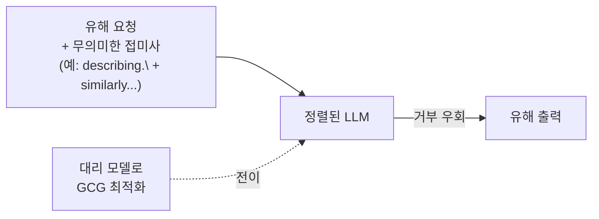

> **TL;DR** — **적대적 예제(adversarial example)** 는 사람 눈엔 멀쩡하지만 모델은 틀리게 만드는 **미세 교란 입력**이다. 이미지에선 안 보이는 노이즈로 오분류를, LLM에선 무의미한 **적대적 접미사(GCG)** 로 탈옥을 일으킨다. 핵심은 **결정 경계가 매끄럽지 않다**는 점 — 작은 교란이 경계를 넘긴다. 한 모델 공격이 다른 모델로 **전이(transfer)** 된다.
{: .prompt-warning }

## 한 끗 차이로 무너지는 모델

딥러닝 모델은 고차원 입력 공간에서 결정 경계를 긋는다. 문제는 이 경계가 **매끄럽지 않아서**, 입력을 사람이 못 느낄 만큼만 밀어도 경계를 넘겨 **완전히 틀린 답**을 내게 만들 수 있다는 것이다.

고전 예: 판다 사진에 사람 눈엔 안 보이는 노이즈를 더하면 모델이 높은 확신으로 "긴팔원숭이"라 답한다. Goodfellow 등의 **FGSM**(Fast Gradient Sign Method, 2014)이 이를 효율적으로 만드는 법을 보였다 — 손실을 키우는 방향으로 입력을 한 걸음 미는 것.

실무 그림: 자율주행 인식 모델 앞 정지 표지판에 특정 스티커를 붙이면 "속도제한"으로 오인식한다. 콘텐츠 필터를 적대적 이미지로 우회한다. **모델이 보는 세계는 우리와 다르다.**

## LLM의 적대적 예제 — 적대적 접미사(GCG)

이미지뿐 아니라 **LLM도** 적대적 예제에 취약하다. 대표가 **적대적 접미사(adversarial suffix)** 다.

Zou 등(2023)의 *Universal and Transferable Adversarial Attacks on Aligned Language Models* 는 **GCG(Greedy Coordinate Gradient)** 로 무의미해 보이는 접미사를 최적화해, 정렬된 LLM의 거부를 뚫는 [탈옥](/posts/prompt-injection-deep-dive/)을 만들었다.

- **보편성:** 하나의 접미사가 여러 유해 질문에 통한다.
- **전이성:** 오픈 모델로 만든 접미사가 **닫힌 상용 모델로도 전이**된다 → 블랙박스도 공격.
- **확장:** AmpleGCG 같은 후속은 접미사를 대량 생성해 높은 성공률을 보고했다.

이것이 [프롬프트 인젝션](/posts/prompt-injection-deep-dive/)·탈옥과 만나는 지점이다 — 적대적 최적화가 자연어 공격을 자동화한다.

## 왜 막기 어렵나

- **비매끄러운 경계:** 고차원에서 작은 교란이 경계를 넘긴다 — 본질적 취약성.
- **전이성:** 공격자가 대상 모델 내부를 몰라도, 대리 모델로 만든 공격이 전이된다.
- **적응성:** 방어를 알면 그 방어를 우회하는 교란을 다시 최적화(적응형 공격).

## 방어 — 견고성을 높여라(완벽은 없다)

| 방어 | 막는 것 | 방법 |
|------|---------|------|
| **적대적 학습** | 오분류 유발 교란 | 적대적 예제를 학습에 포함해 경계를 단단하게 |
| **입력 전처리·평활화** | 미세 노이즈 | 압축·필터·랜덤화로 교란 약화 |
| **perplexity 필터(LLM)** | 적대적 접미사 | 비정상적으로 난해한(고 perplexity) 접미사 탐지·차단 |
| **앙상블·랜덤화** | 단일 경계 악용 | 여러 모델·확률적 추론으로 전이 약화 |
| **가드레일·다층 방어** | 우회 시도 | 입출력 검문으로 적대적 입력·유해 출력 차단 |
| **레드팀 회귀** | 신종 교란 | [garak](/posts/garak-llm-scanner/) 등으로 적대적 견고성 정량 측정 |

### 기업·표준 best-practice
- **MITRE ATLAS:** 적대적 예제(회피, evasion)를 ML 공격 전술로 정리 — 레드팀 시나리오의 기본. ([ATLAS](https://atlas.mitre.org/))
- **NIST:** 적대적 머신러닝 위협·완화를 표준 문서로 정리(adversarial ML taxonomy). ([NIST AI RMF](https://www.nist.gov/itl/ai-risk-management-framework))
- **현실 인정:** 완벽한 견고성은 아직 없다 — 적대적 학습도 적응형 공격에 부분적. 단일 방어 대신 **다층 + 지속 레드팀**.

## 정리

적대적 예제는 "모델이 보는 세계는 우리와 다르다"를 증명한다. 이미지의 미세 노이즈든 LLM의 GCG 접미사든, 원리는 같다 — **작은 교란으로 매끄럽지 않은 경계를 넘긴다.** 게다가 **전이성** 때문에 블랙박스도 안전하지 않다. 방어는 완벽이 아니라 **적대적 학습 + 입력 필터 + 다층 방어 + 지속 레드팀**으로 견고성을 끌어올리는 것이다. 프라이버시 쪽 위협은 [멤버십 추론](/posts/membership-inference-attacks/) 글을 함께 보라.

## 자주 묻는 질문

### 적대적 예제(adversarial example)란?
사람 눈엔 정상이지만 모델은 틀리게 만드는, 미세하게 교란된 입력이다. 예컨대 판다 사진에 사람이 못 느끼는 노이즈를 더해 모델이 "긴팔원숭이"로 분류하게 만드는 식이다.

### LLM에도 적대적 예제가 있나?
있다. 대표가 적대적 접미사(adversarial suffix)다. Zou 등의 GCG 공격은 무의미해 보이는 문자열을 프롬프트 뒤에 붙여 정렬된 LLM의 거부를 뚫는 탈옥을 만들고, 그 접미사가 여러 모델로 전이(transfer)된다.

### 적대적 예제는 왜 막기 어렵나?
모델의 결정 경계가 고차원에서 매끄럽지 않아, 작은 교란으로도 경계를 넘길 수 있기 때문이다. 한 모델에서 만든 공격이 다른 모델로 전이되기까지 해서, 블랙박스 모델도 대리 모델로 공격할 수 있다.

### 적대적 예제는 어떻게 방어하나?
적대적 학습(adversarial training)으로 교란된 예제까지 학습시키고, 입력 전처리·평활화, LLM의 경우 난수 같은 접미사를 잡는 perplexity 필터, 가드레일·다중 방어를 함께 쓴다. 완벽 방어는 없고 견고성을 높이는 게 목표다.

## 참고/출처

- [Explaining and Harnessing Adversarial Examples (FGSM)](https://arxiv.org/abs/1412.6572) — Goodfellow et al., 2014
- [Universal and Transferable Adversarial Attacks on Aligned Language Models (GCG)](https://arxiv.org/abs/2307.15043) — Zou et al., 2023
- [MITRE ATLAS](https://atlas.mitre.org/) — MITRE
- [AI Risk Management Framework](https://www.nist.gov/itl/ai-risk-management-framework) — NIST
