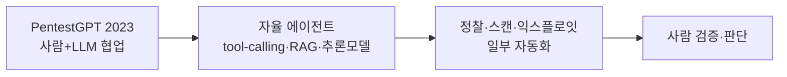

> **TL;DR** — LLM은 **침투테스트(pentest)** 의 정찰·공격 체인 구성·반복 작업에 강하다. PentestGPT(2023)는 "LLM은 해킹 능력은 있으나 컨텍스트 관리(기억·환각)가 약하다"를 보였고, 2025년 연구는 그 **효능을 재확인**했다. 단 환각·장기기억 한계로 **완전 자율보다 사람과 협업**이 현실적이고, **권한 없는 대상엔 절대 금지**. 방어자가 먼저 써서 약점을 찾는 [AI for Security](/posts/what-is-ai-red-teaming/)의 한 축.
{: .prompt-tip }

> **윤리·법 경고** — 이 글은 **방어·인가된 테스트** 관점이다. 침투테스트는 **본인 소유 또는 서면 허가받은 시스템·정식 계약 범위**에서만. 무단 수행은 도구가 AI든 아니든 불법이다.
{: .prompt-danger }

## 왜 LLM이 pentest에 맞나

침투테스트는 정찰 → 취약점 식별 → 익스플로잇 → 권한상승 → 보고로 이어지는 **패턴 인식과 추론의 연속**이다. LLM은 바로 이 지점에 강하다 — 방대한 보안 지식을 학습했고, 로그·코드·응답에서 약점 패턴을 찾고, 공격 체인을 자연어로 설계한다.

실무 그림: 모의해킹 팀이 수백 개 엔드포인트를 점검할 때, LLM 에이전트가 1차 정찰·흔한 오설정 탐지·페이로드 초안을 빠르게 만들어 주면, 사람은 검증과 고난도 익스플로잇에 집중한다. **AI가 잡일을 줄이고 사람이 판단을 더한다.**

## 도구의 진화



- **PentestGPT(2023):** 사람 운영자와 LLM이 상호작용해 CTF·시스템을 점검. **"LLM은 해킹 능력은 있으나 컨텍스트 관리가 약하다"** 를 처음 명확히 함 — 장기기억 부재·최신성 편향·환각.
- **자율 에이전트(2024~):** tool-calling, 구조화 출력, 큰 컨텍스트(예: 100만 토큰), RAG, 추론 모델이 더 복잡한 다단계 자동화를 가능케 함.
- **2025 연구:** Happe & Cito의 *On the Surprising Efficacy of LLMs for Penetration-Testing* 는 LLM이 침투테스트 성능을 크게 끌어올림을 재확인하면서, 동시에 한계를 짚었다.

**실제 협업은 어떤 모습인가 (인가된 점검 예시):** LLM pentest 도구는 보통 **정찰 결과를 주면 다음 단계를 제안**하는 식으로 사람과 오간다(아래는 자기 소유/인가된 테스트 환경 기준 예시):

```text
[사람] nmap 결과: 22/tcp open ssh, 80/tcp open http(Apache 2.4.49)
[LLM ] Apache 2.4.49는 경로 탐색(CVE-2021-41773) 영향 버전일 수 있습니다.
       1) /cgi-bin/ 활성 여부 확인  2) 버전 정확 식별  3) 인가 범위 재확인 후 점검.
       ※ 실제 점검 전 스코프·허가를 반드시 확인하세요.
[사람] (검증) 버전 맞고, 스코프 내 → 안전하게 재현 절차 진행
```

LLM은 **알려진 취약점 매핑·다음 단계 제안·문서화**를 가속한다. 단 버전·CVE를 **환각**할 수 있어(없는 취약점 지어냄) 사람 검증이 필수다. (위는 작동 익스플로잇이 아니라 협업 흐름 예시다.)

## 한계 — 환각하는 해커

LLM pentest를 맹신하면 위험하다.

- **환각:** 존재하지 않는 취약점·명령·CVE를 지어낸다 → 헛다리·오탐.
- **컨텍스트·기억 한계:** 다단계 익스플로잇에서 앞 단계를 잊거나 길을 잃는다.
- **복잡성 한계:** 정교한 연쇄 익스플로잇·신종 취약점은 아직 사람이 우위.
- **그래서:** 결과는 **항상 사람이 검증**. 자동화는 정찰·반복·문서화 보조에 가장 효과적.

## 방어자 관점 — 먼저 써서 먼저 찾아라

[AI for Security](/posts/what-is-ai-red-teaming/)의 핵심은 **방어자가 공격 도구를 먼저 쓰는 것**이다.

| 활용 | 효과 | 주의 |
|------|------|------|
| **정찰·자산 식별 자동화** | 점검 속도↑ | 결과 검증 필수 |
| **오설정·흔한 취약점 스캔** | 1차 커버리지 | 오탐/환각 필터 |
| **페이로드·체인 초안** | 아이디어 가속 | 사람이 안전성 확인 |
| **보고서 자동화** | 문서 부담↓ | 사실 검증 |
| **레드팀 회귀** | [garak](/posts/garak-llm-scanner/)·[PyRIT](/posts/pyrit-red-teaming/)와 결합 | 인가 범위 내 |

### 기업·표준 best-practice
- **권한·범위 우선:** 정식 계약·서면 허가·scope 정의가 모든 것에 선행. 무단 사용 금지.
- **사람 검증 루프:** LLM 출력을 자동 실행하지 말고 HITL로 검증 — 환각이 곧 오탐·사고.
- **이중 용도 인식:** 같은 능력이 공격에도 쓰인다 → 방어 강화에 우선 투자(이 시리즈의 방어 글들과 함께).

## 정리

LLM은 침투테스트를 **대체**하는 게 아니라 **증폭**한다 — 정찰·반복은 빠르게, 판단·검증은 사람이. PentestGPT가 연 길을 자율 에이전트가 넓혔지만, 환각·기억 한계는 여전하다. 가장 중요한 건 기술이 아니라 **권한과 윤리** — 인가된 범위에서, 방어를 위해. 다음 편에서는 AI가 **취약점을 직접 찾아낸** 실제 사례(Google Big Sleep)를 다룬다.

## 자주 묻는 질문

### LLM이 침투테스트를 할 수 있나?
부분적으로 가능하다. LLM은 패턴 인식·공격 체인 구성·정찰에 강해 PentestGPT 같은 도구가 CTF·실제 시스템 점검을 돕는다. 다만 장기 기억·컨텍스트 관리·환각 문제로 아직 완전 자율보다는 사람과 협업하는 형태가 현실적이다.

### PentestGPT는 무엇인가?
2023년 공개된, 사람 운영자와 LLM이 상호작용하며 침투테스트를 수행하는 도구다. "LLM은 해킹에 필요한 내재 능력은 있지만 컨텍스트 관리(장기기억·최신성 편향·환각)에 문제가 있다"를 처음 명확히 한 연구다.

### LLM 침투테스트의 한계는?
환각(없는 취약점·명령을 지어냄), 제한된 컨텍스트와 장기 기억 부재, 복잡한 다단계 익스플로잇에서의 실패가 대표적이다. 그래서 결과는 항상 사람이 검증해야 하고, 자동화는 정찰·반복 작업 보조에 가장 효과적이다.

### LLM 침투테스트는 합법인가?
도구가 아니라 대상과 권한의 문제다. 본인 소유이거나 명시적 서면 허가를 받은 시스템에만 수행해야 한다. 무단 스캔·익스플로잇은 도구가 AI든 아니든 불법이다. 정식 계약 범위(scope) 안에서만.

## 참고/출처

- [On the Surprising Efficacy of LLMs for Penetration-Testing](https://arxiv.org/abs/2507.00829) — Happe & Cito (TU Wien), 2025
- [PentestGPT: Evaluating and Harnessing LLMs for Automated Penetration Testing](https://arxiv.org/abs/2308.06782) — Deng et al., 2023
- [AutoPentest: Enhancing Vulnerability Management With Autonomous LLM Agents](https://arxiv.org/abs/2505.10321) — arXiv, 2025
