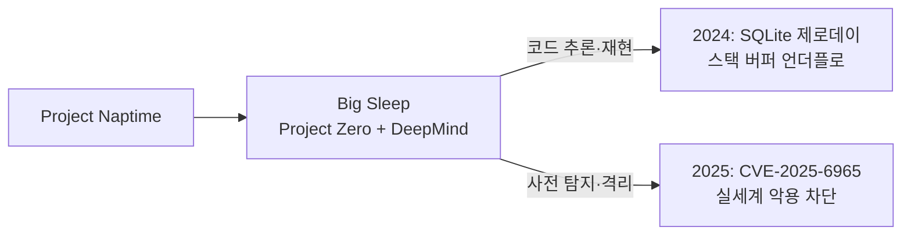

> **TL;DR** — AI가 **소프트웨어 취약점을 직접 찾는** 시대가 열렸다. Google **Big Sleep**(Project Zero + DeepMind)은 2024년 널리 쓰이는 **SQLite에서 제로데이**를 찾아 "AI가 발견한 첫 실세계 취약점"으로 기록됐고, 2025년엔 공격자가 악용을 준비하던 SQLite 취약점(**CVE-2025-6965**)을 사전 격리해 **실세계 악용을 막았다**. 방어자가 먼저 찾는 [AI for Security](/posts/what-is-ai-red-teaming/)의 결정적 사례.
{: .prompt-tip }

## 공격자도 AI를 쓴다 — 그래서 방어자가 먼저

[적대적 예제](/posts/prompt-injection-deep-dive/)·익스플로잇 자동화처럼 공격에도 AI가 쓰인다. 그렇다면 방어자가 먼저, 더 빠르게 취약점을 찾아 고치면 **비대칭 우위**를 만들 수 있다. 사람 분석가가 수개월 걸리던 코드 감사를, AI가 보조하면 더 넓고 빠르게 훑는다.

핵심은 LLM의 **코드 이해·추론** 능력이다. 단순 패턴 매칭(전통 정적분석)을 넘어, "이 함수가 이 값을 이렇게 다루면 여기서 메모리 경계를 넘는다" 같은 **의미 수준 추론**을 한다.

## 사례 — Google Big Sleep

**Big Sleep**(옛 Project Naptime)은 Google Project Zero와 DeepMind의 협업 에이전트로, LLM의 코드 이해·추론으로 **사람 분석가처럼** 취약점을 찾고 재현한다.

- **2024 — 첫 실세계 발견:** 널리 쓰이는 **SQLite**에서 **스택 버퍼 언더플로** 제로데이를 발견(`seriesBestIndex` 함수가 sentinel 값 -1을 잘못 처리). Google은 이를 "AI 에이전트가 찾은 첫 실세계 취약점"으로 발표.
- **2025 — 실제 악용 차단:** **CVE-2025-6965**(CVSS 7.2, 메모리 손상)를 Big Sleep이 사전 격리 — 위협 행위자가 악용을 준비하던 취약점을 **AI가 먼저 막은 첫 사례**.

이건 데모가 아니라 **출시·운영 중인 소프트웨어**에서의 실적이다.

## 어떻게 찾나 — 기법

- **LLM 코드 추론:** 코드를 따라가며 위험한 데이터 흐름·경계 조건을 추론(Big Sleep 방식).
- **AI 강화 퍼징:** LLM이 똑똑한 입력·하니스를 생성해 퍼저(예: OSS-Fuzz)의 도달 범위를 넓힘.
- **자동 트리아지:** 대량의 정적분석·퍼징 결과를 LLM이 우선순위화·요약.
- **자동 패치 제안:** 발견한 취약점의 수정안 초안 생성(사람 검토 전제).

## 한계 — 만능 분석가는 아니다

| 한계 | 내용 | 대응 |
|------|------|------|
| **오탐** | 없는 취약점·잘못된 경로 보고 | 사람 트리아지·재현 검증 |
| **복잡성 누락** | 다단계·로직 취약점 놓침 | 퍼징·수동 감사와 병행 |
| **검증 비용** | 보고를 사람이 확인해야 | 우선순위화로 부담 완화 |
| **보완재** | 정적분석·퍼징 대체 아님 | 기존 파이프라인에 결합 |

## 방어 파이프라인에 넣기 (best-practice)

- **결합:** AI 탐지를 퍼징·정적분석·코드리뷰 파이프라인에 **추가 레이어**로. 대체 아님.
- **사람 검증 루프:** AI 보고는 트리아지·재현으로 확정. 오탐을 자동 신뢰 금지.
- **공개 협업:** Google Project Zero의 ["From Naptime to Big Sleep"](https://projectzero.google/2024/10/from-naptime-to-big-sleep.html) 같은 공개 연구가 방법론을 끌어올린다.
- **AI for Security 동향:** [garak](/posts/garak-llm-scanner/)·[PyRIT](/posts/pyrit-red-teaming/)가 모델 약점을 찾듯, Big Sleep은 코드 약점을 찾는다 — 둘 다 "방어자가 먼저".

## 정리

Big Sleep은 "AI가 실제 소프트웨어 취약점을 찾고, 실제 악용까지 막는다"를 증명했다. 공격자도 AI를 쓰는 이상, **방어자의 AI 활용은 선택이 아니라 균형 유지의 필수**다. 단 AI는 사람 분석가를 **대체**하지 않고 **증폭**한다 — 넓게 빠르게 훑고, 판단·검증은 사람이. 침투테스트 자동화는 [LLM 침투테스트](/posts/llm-penetration-testing/) 편을 함께 보라.

## 자주 묻는 질문

### AI가 실제로 소프트웨어 취약점을 찾을 수 있나?
그렇다. Google의 Big Sleep 에이전트는 2024년 널리 쓰이는 SQLite 데이터베이스 엔진에서 제로데이(스택 버퍼 언더플로)를 찾아냈고, 이는 AI 에이전트가 실제 소프트웨어에서 발견한 첫 실세계 취약점으로 보고됐다.

### Big Sleep이란 무엇인가?
Google Project Zero와 DeepMind가 협업한 LLM 기반 취약점 탐지 에이전트다(옛 Project Naptime). LLM의 코드 이해·추론 능력으로 사람 분석가처럼 코드를 따라가며 취약점을 찾고 재현한다.

### AI 취약점 탐지가 왜 중요한가?
공격자도 AI로 취약점을 찾는 시대에, 방어자가 먼저 더 빠르게 찾아 고치는 비대칭을 만들 수 있기 때문이다. 실제로 Big Sleep은 공격자가 악용을 준비하던 SQLite 취약점(CVE-2025-6965)을 사전에 격리해 실세계 악용을 막았다.

### AI 취약점 탐지의 한계는?
오탐(없는 취약점 보고), 복잡한 로직·다단계 취약점에서의 누락, 검증 비용이 있다. 그래서 사람 분석가의 트리아지·검증과 결합해야 하며, 퍼징·정적분석 등 기존 기법을 대체가 아니라 보완한다.

## 참고/출처

- [From Naptime to Big Sleep: Using LLMs To Catch Vulnerabilities In Real-World Code](https://projectzero.google/2024/10/from-naptime-to-big-sleep.html) — Google Project Zero, 2024
- [Google AI Big Sleep Stops Exploitation of Critical SQLite Vulnerability](https://thehackernews.com/2025/07/google-ai-big-sleep-stops-exploitation.html) — The Hacker News, 2025
- [CVE-2025-6965](https://nvd.nist.gov/vuln/detail/CVE-2025-6965) — NVD
